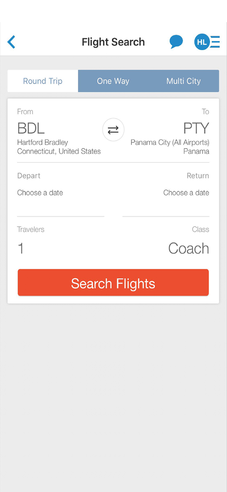
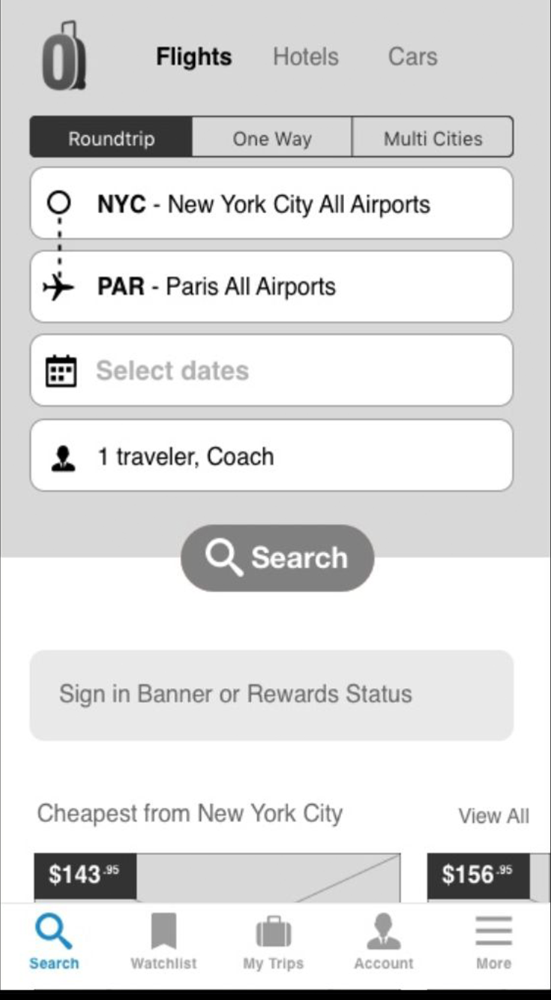
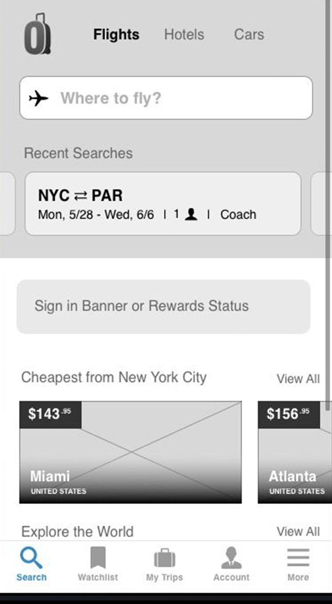

  

    <header class="content-section__header">
      <h3 class="h3">Project background</h3>
    </header>
    <dl>
      <dt>Product issue</dt>
      <dd>
        High bounce rate from landing screen (Fig.1)
      </dd>
      <dt>User Test Finding</dt>
      <dd>
        "I don't see what I can do..." (Search)
      </dd>
      <dt>Product goal</dt>
      <dd>
        <ol class="ordered-list">
          <li>Increase flight search rate</li>
          <li>Reduce bounce rate</li>
        </ol>
      </dd>
      <dt>Design challenge</dt>
      <dd>
        Spare the space for post-booking and marketing components
      </dd>
    </dl>
  

  

    <figure class="project-content__figure">
      
      <figcaption>Fig.1: Landing screen</figcaption>
    </figure>
    <figure class="project-content__figure">
      
      <figcaption>Fig.2: Search screen</figcaption>
    </figure>
  

  

    <header class="content-section__header">
      <h3 class="h3">Diverge solutions</h3>
    </header>
    <dl>
      <dt>Option A</dt>
      <dd>
        <ul class="bulleted-list">
          <li>Full search + Extra component</li>
          <li>Users would miss additional context below the fold</li>
          <li><a href="#" class="text-sm text-gray-600">Open wireframe</a></li>
        </ul>
      </dd>
      <dt>Option B</dt>
      <dd>
        <ul class="bulleted-list">
          <li>Minimal search bar to save more space</li>
          <li>User wouldn't associate the minimal search bar UI with the concept of travel search</li>
          <li><a href="#" class="text-sm text-gray-600">Open wireframe</a></li>
        </ul>
      </dd>
    </dl>
  

  

    <figure class="project-content__figure">
      
      <figcaption>Fig.3: Option A</figcaption>
    </figure>
    <figure class="project-content__figure">
      
      <figcaption>Fig.4: Option B</figcaption>
    </figure>
  

  <header class="content-section__header">
    <h3 class="h3">Test</h3>
  </header>
  

    Han Lee, a product designer who helps to solve UI/UX problems of digital products, through front-end development and product consulting for 10+ years. Han Lee, a product designer who helps to solve UI/UX problems of digital products, through front-end development and product consulting for 10+ years. Han Lee, a product designer who helps to solve UI/UX problems of digital products, through front-end development and product consulting for 10+ years. Han Lee, a product designer who helps to solve UI/UX problems of digital products, through front-end development and product consulting for 10+ years. Han Lee, a product designer who helps to solve UI/UX problems of digital products, through front-end development and product consulting for 10+ years. Han Lee, a product designer who helps to solve UI/UX problems of digital products, through front-end development and product consulting for 10+ years. Han Lee, a product designer who helps to solve UI/UX problems of digital products, through front-end development and product consulting for 10+ years. Han Lee, a product designer who helps to solve UI/UX problems of digital products, through front-end development and product consulting for 10+ years.
  

  

    Han Lee, a product designer who helps to solve UI/UX problems of digital products, through front-end development and product consulting for 10+ years. Han Lee, a product designer who helps to solve UI/UX problems of digital products, through front-end development and product consulting for 10+ years. Han Lee, a product designer who helps to solve UI/UX problems of digital products, through front-end development and product consulting for 10+ years. Han Lee, a product designer who helps to solve UI/UX problems of digital products, through front-end development and product consulting for 10+ years. Han Lee, a product designer who helps to solve UI/UX problems of digital products, through front-end development and product consulting for 10+ years. Han Lee, a product designer who helps to solve UI/UX problems of digital products, through front-end development and product consulting for 10+ years. Han Lee, a product designer who helps to solve UI/UX problems of digital products, through front-end development and product consulting for 10+ years. Han Lee, a product designer who helps to solve UI/UX problems of digital products, through front-end development and product consulting for 10+ years.
  

