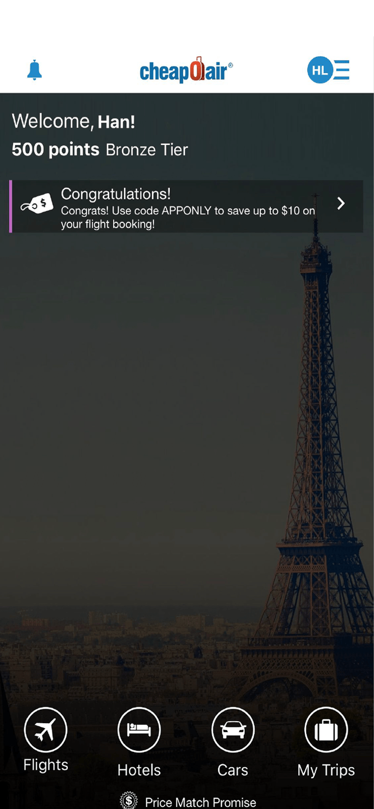
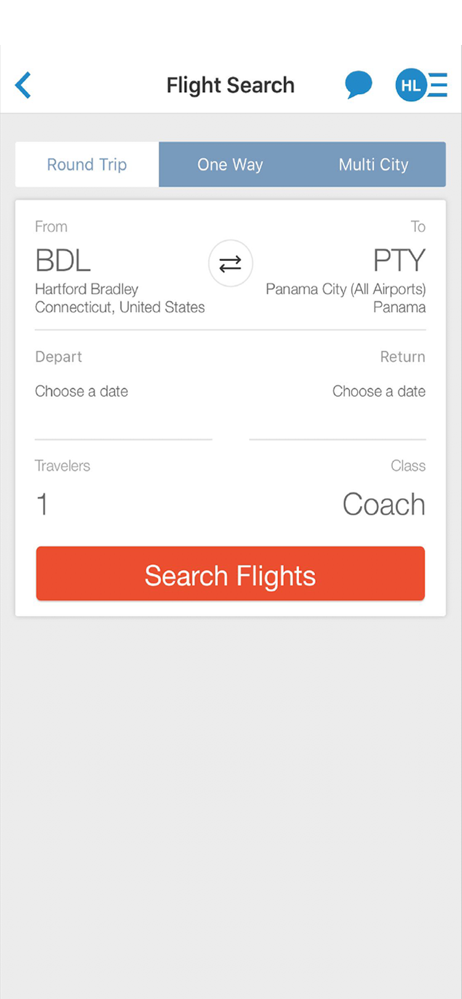
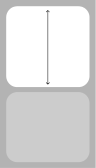
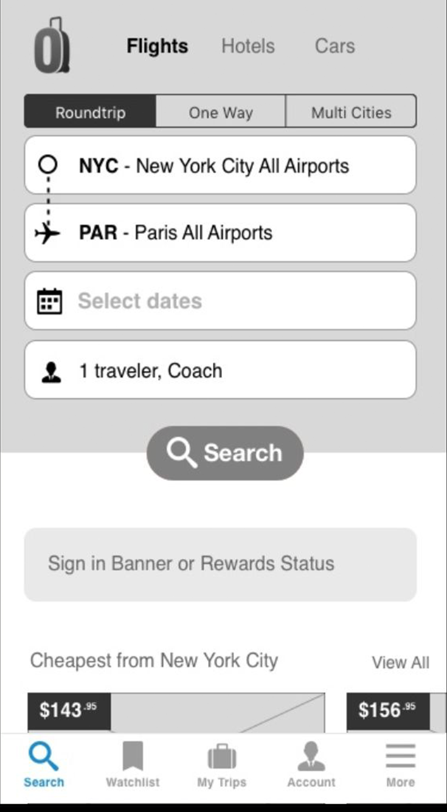
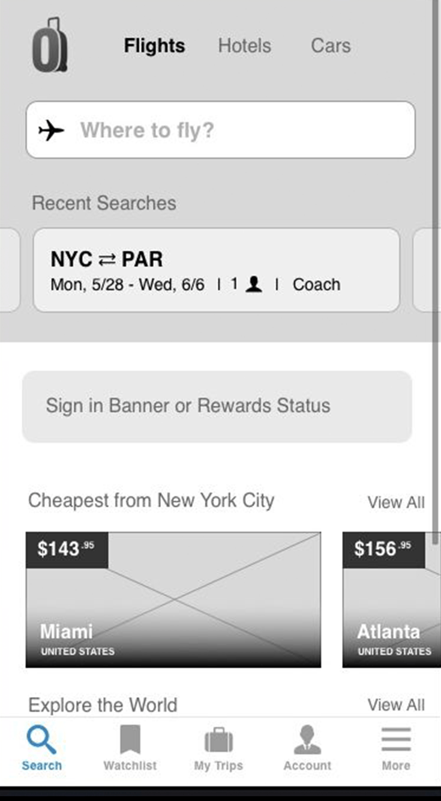
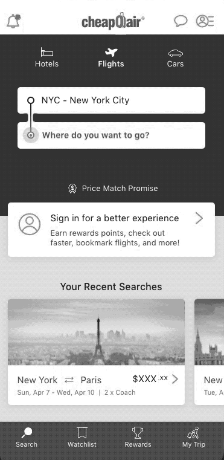
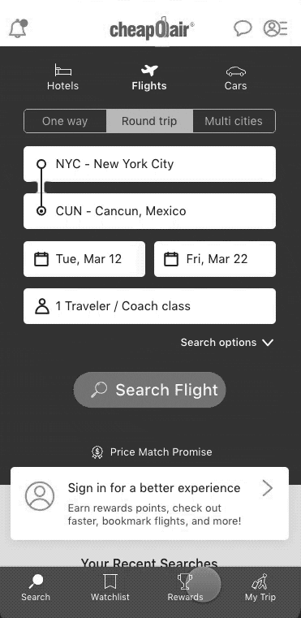
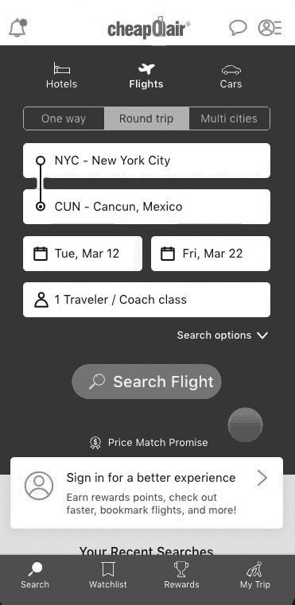
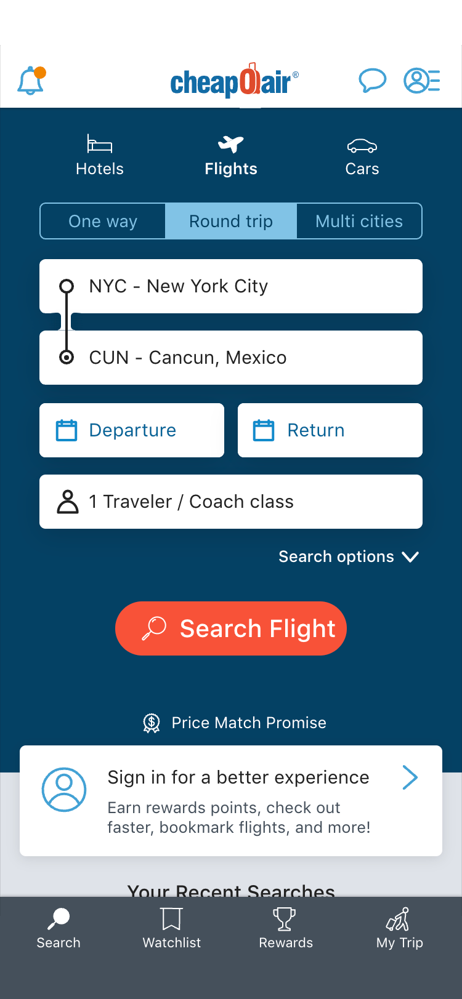
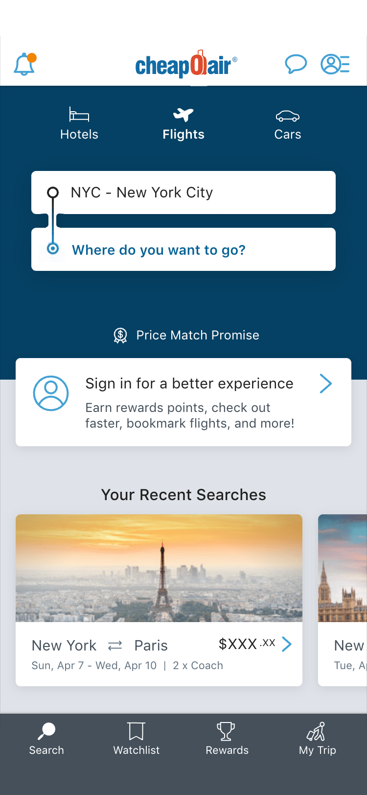

  

    <header class="content-section__header">
      <b class="content-section__eyebrow">Project background</b>
      <h3 class="h3">The challenge</h3>
    </header>
    <dl>
      <dt>Product issue</dt>
      <dd>
        High bounce rate from landing screen (Fig.1)
      </dd>
      <dt>User Test Finding</dt>
      <dd>
        <blockquote class="quote">
          "I don't see what I can do here..." (Search)
        </blockquote>
      </dd>
      <dt>Product goal</dt>
      <dd>
        <ul class="bulleted-list">
          <li>Increase flight search rate</li>
          <li>Reduce bounce rate</li>
        </ul>
      </dd>
      <dt>Design challenge</dt>
      <dd>
        How might we make it easy to tell and discover a future story without writing an entire article? 
      </dd>
    </dl>
  

  

    <figure class="project-content__figure">
      
      <figcaption>Fig.1: Landing screen</figcaption>
    </figure>
    <figure class="project-content__figure">
      
      <figcaption>Fig.2: Search screen</figcaption>
    </figure>
  

  

    <header class="content-section__header">
      <b class="content-section__eyebrow">Key Stage #1</b>
      <h3 class="h3">Reframing the problem</h3>
    </header>
    

      Search needed to be obvious, but there're other things needed to be on the page.
      <b class="block">↳ How much of the screen should search occupy?</b>
    

    <dl>
      <dt>Flight search (primary action by chance)</dt>
      <dd>Help majority of users see where to start right away.</dd>
      <dt>Everything else (secondary by choice)</dt>
      <dd>Leave enough space for post-booking and marketing content.</dd>
    </dl>
  

  

    <figure class="project-content__figure">
      
      <figcaption>How important the search is?</figcaption>
    </figure>
  

  

    <header class="content-section__header">
      <b class="content-section__eyebrow">Key Stage #2</b>
      <h3 class="h3">Exploring the trade-off</h4>
    </header>
    <dl>
      <dt>Option A — Full search</dt>
      <dd>
        <ul class="bulleted-list">
          <li>Give users the complete search interface immediately</li>
          <li>Trade-off: Secondary content was pushed below the fold, reducing its visibility</li>
          <li><a href="https://projects.invisionapp.com/share/MPNTZTV9RHG#/screens/318101850" target="_blank" rel="noreferrer" class="text-sm text-gray-600 button button--link">Open wireframe</a></li>
        </ul>
      </dd>
      <dt>Option B — Minimal search</dt>
      <dd>
        <ul class="bulleted-list">
          <li>Reduce search to a smaller entry point to preserve more space</li>
          <li>Trade-off: The reduced UI was less recognizable as a travel search experience</li>
          <li><a href="https://projects.invisionapp.com/share/MPNTZTV9RHG#/screens/317587837" target="_blank" rel="noreferrer" class="text-sm text-gray-600 button button--link">Open wireframe</a></li>
        </ul>
      </dd>
    </dl>
  

  

    <figure class="project-content__figure">
      
      <figcaption>Fig.3: Option A</figcaption>
    </figure>
    <figure class="project-content__figure">
      
      <figcaption>Fig.4: Option B</figcaption>
    </figure>
  

  

    <header class="content-section__header">
      <b class="content-section__eyebrow">Key Stage #3</b>
      <h3 class="h3">Converting the trade-off</h3>
    </header>
    

      <b>Turning it into an interactive crossroads:</b> expanding as the user needed more information
    

    <dl>
      <dt>Option C - Expandable search</dt>
      <dd>
        <ul class="bulleted-list">
          <li>Initial state: communicates the concept of travel search</li>
          <li>Engaged state: user's action will define path (Typing VS. Scrolling) </li>
        </ul>
      </dd>
    </dl>
  

  

    <figure class="project-content__figure project-content__figure--gif">
      
      <figcaption>Fig.7: Option C search view</figcaption>
    </figure>
    <figure class="project-content__figure project-content__figure--gif">
      
      <figcaption>Fig.6: Option C initial view</figcaption>
    </figure>
    <figure class="project-content__figure project-content__figure--gif">
      
      <figcaption>Fig.6: Option C initial view</figcaption>
    </figure>
  

  

    <header class="content-section__header">
      <b class="content-section__eyebrow">Key Stage #4</b>
      <h3 class="h3">Final design</h3>
    </header>
    <dl>
      <dt>Visual design</dt>
      <dd>
        <ul class="bulleted-list">
          <li>Color distinguishes IA and status of interaction</li>
          <li>Animation emphasizes visual cue</li>
        </ul>
      </dd>
      <dt>Interaction sequence</dt>
      <dd>
        <ol class="ordered-list">
          <li>Initial view</li>
          <li>Searching: user enters location > search section enpanded</li>
          <li>Exploring: user interact other components > moves toward to each path</li>
        </ol>
      </dd>
    </dl>
    <a href="https://preview.uxpin.com/6178e38c68fdc4e35512c57e84b9a96790b8c9b2#/pages//simulate/sitemap?mode=ch" target="_blank" rel="noreferrer" class="text-sm text-gray-600 button button--link mt-4">Open interactive prototype</a>
  

  

    <figure class="project-content__figure">
      
      <figcaption>Fig.7: Search view</figcaption>
    </figure>
    <figure class="project-content__figure">
      
      <figcaption>Fig.6: Initial view</figcaption>
    </figure>
  

  

    <header class="content-section__header">
      <b class="content-section__eyebrow">Learnings</b>
      <h3 class="h3">"Design around the user's level of intent."</h3>
    </header>
    

      

        This project reinforced something I continue to use in my product design work:
        <b>An interface doesn't always need to show everything at once.</b>
      

      

        When users are still deciding what to do, clarity can come from showing less.
        As their intent becomes clearer, the interface can reveal more context and detail.
      

    

  

