

  

    <header class="content-section__header">
      <h3 class="h3">Project background</h3>
    </header>
    <dl>
      <dt>Product issue</dt>
      <dd>
        Users abandon the booking path after selecting the flight from the listing
      </dd>
      <dt>User Test Finding</dt>
      <dd>
        <ul class="bulleted-list">
          <li>"I already selected what I want. I want to book it while it's available."</li>
          <li>"I need to check overlay details before select the flight."</li>
        </ul>
      </dd>
      <dt>Product goal</dt>
      <dd>
        <ul class="bulleted-list">
          <li>Increase listing - booking page funnel</li>
          <li>Reduce bounce rate during the booking process</li>
        </ul>
      </dd>
      <dt>Design challenge</dt>
      <dd>
        Flight details should be available in the booking path but should not compete with tier 1 context of the pages
      </dd>
    </dl>
  

  

    <figure class="project-content__figure">
      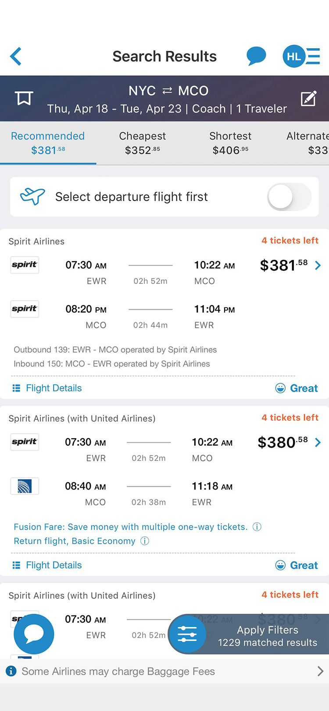
      <figcaption>Fig.1: Listing screen</figcaption>
    </figure>
    <figure class="project-content__figure">
      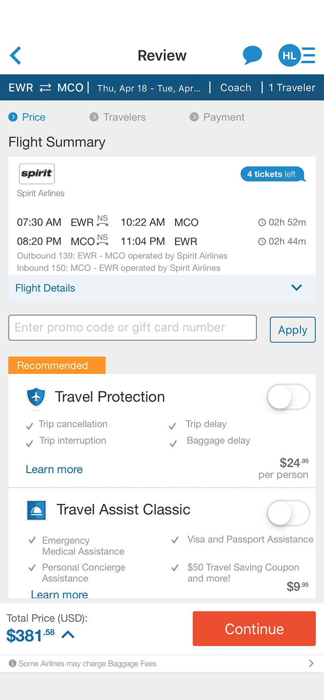
      <figcaption>Fig.2: Review screen</figcaption>
    </figure>
  

  

    <header class="content-section__header">
      <h3 class="h3">Draft solutions</h3>
    </header>
    <dl>
      <dt>Suggestion</dt>
      <dd>
        <ol class="ordered-list">
          <li>Add flight detail screen as a drawer view - linked from both listing and booking</li>
          <li>Rearrange booking input fields - first booking step</li>
        </ol>
      </dd>
      <dt>Diverge options</dt>
      <dd>
        <dl class="definition-list bulleted-list">
          <dt>Option A</dt>
          <dd>
            <ul>
              <li>Add flight detail screen as a mandatory step: Listing > Details > Booking</li>
            </ul>
          </dd>
          <dt>Option B</dt>
          <dd>
            <ul>
              <li>Add flight detail screen as an optional step: Listing > Details > Booking</li>
            </ul>
          </dd>
        </dl>
      </dd>
      <dt>Wireframe and user test</dt>
      <dd>
        <ul class="bulleted-list">
          <li>6/10 Users reacted positively with Option B</li>
          <li>2/10 Users reacted positively with Option A</li>
          <li>2/10 Users reacted neutral</li>
          <li><a href="https://preview.uxpin.com/1b5bd2839b4c6429c7afafa3b8b43b31eceee645ch" target="_blank" rel="noreferrer" class="text-sm text-gray-600">Open option B wireframe</a></li>
        </ul>
      </dd>
    </dl>
  

  

    <figure class="project-content__figure">
      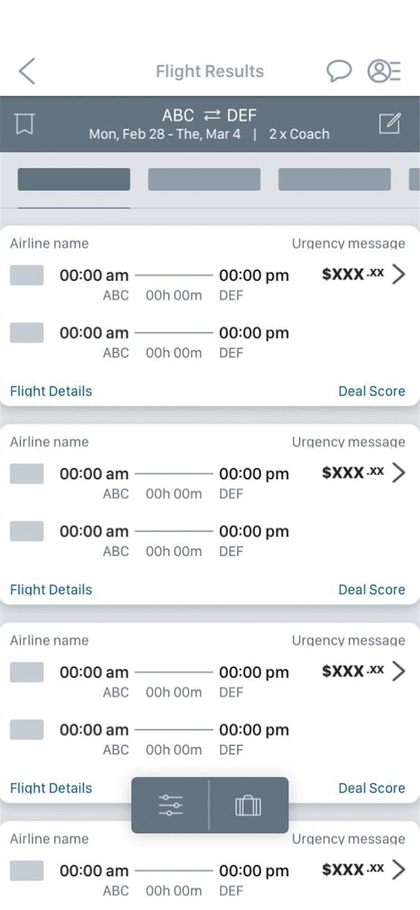
      <figcaption>Fig.3: Listing wireframe</figcaption>
    </figure>
    <figure class="project-content__figure">
      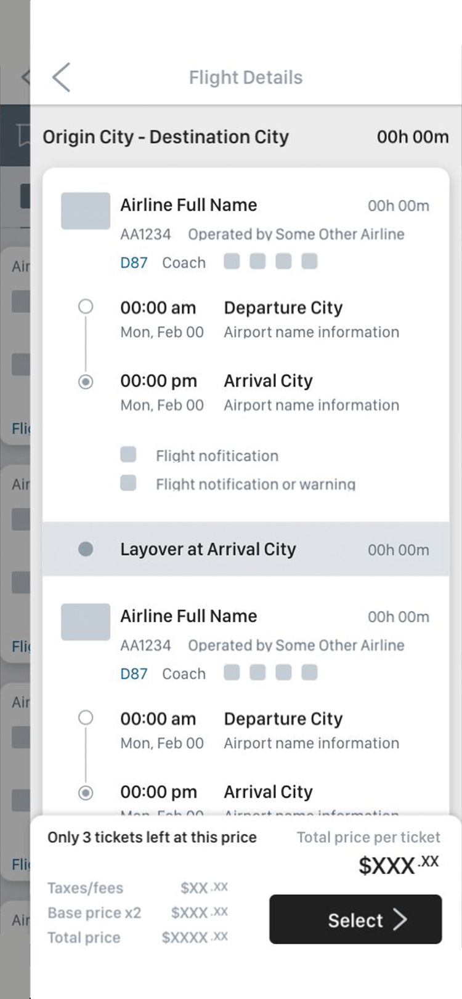
      <figcaption>Fig.4: Detail wireframe</figcaption>
    </figure>
    <figure class="project-content__figure">
      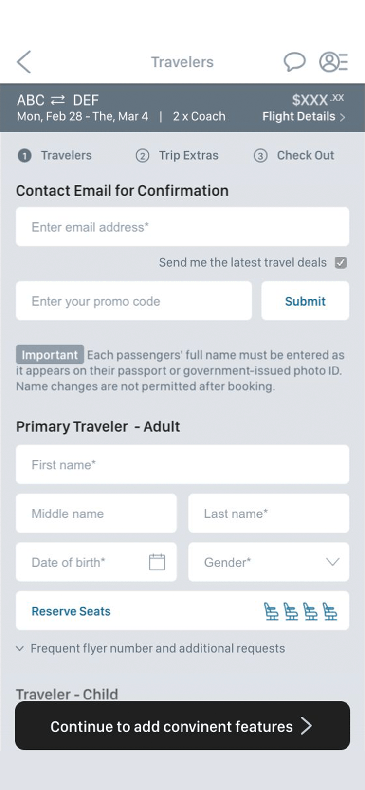
      <figcaption>Fig.5: Booking wireframe</figcaption>
    </figure>
  

  

    <header class="content-section__header">
      <h3 class="h3">Converge and Prototype</h3>
    </header>
    <dl>
      <dt>Visual design</dt>
      <dd>
        <ul class="bulleted-list">
          <li>Emphasize critical information (stops, alternate airport, etc.)</li>
          <li>Clarify the group of information using spacing, background-color</li>
          <li>Build a card component for consistent section</li>
        </ul>
      </dd>
      <dt>Visual cues</dt>
      <dd>
        <ul class="bulleted-list">
          <li>Navigating icon: back vs. close</li>
          <li>Timeline icon: point a vs. point b</li>
          <li>Highlighted text: critical information</li>
          <li>Status code: filled (active) vs empty (inactive)</li>
        </ul>
      </dd>
    </dl>
    <a href="https://preview.uxpin.com/8024107a9a5d61961f769228aecf94aa73f2ce60#/pages//simulate/sitemap?mode=ch" target="_blank" rel="noreferrer" class="button button--ghost button--sm mt-4">Open interactive prototype</a>
  

  

    <figure class="project-content__figure">
      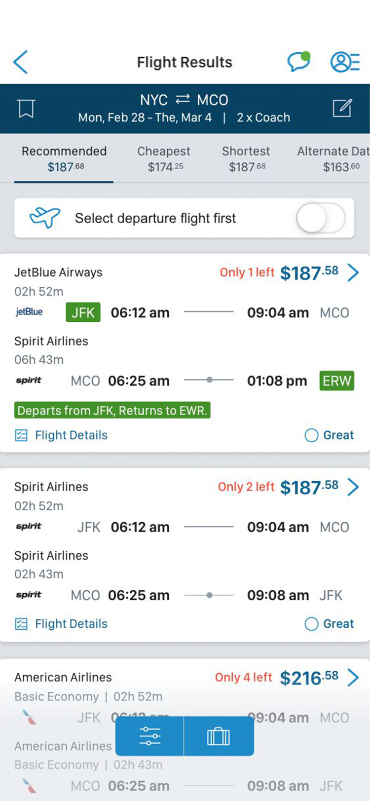
      <figcaption>Fig.6: Listing screen</figcaption>
    </figure>
    <figure class="project-content__figure">
      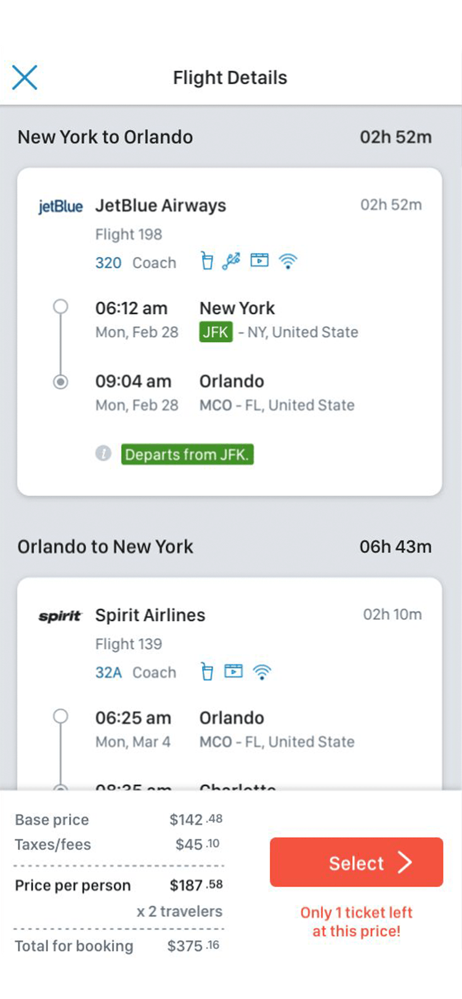
      <figcaption>Fig.7: Detail screen</figcaption>
    </figure>
    <figure class="project-content__figure">
      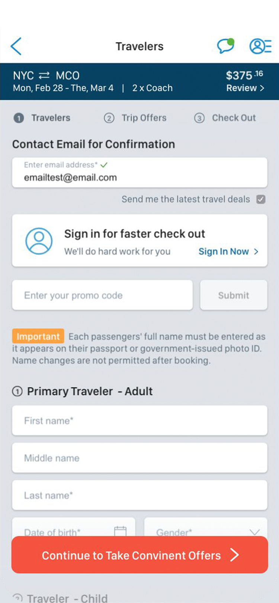
      <figcaption>Fig.8: Booking screen - 1</figcaption>
    </figure>
    <figure class="project-content__figure">
      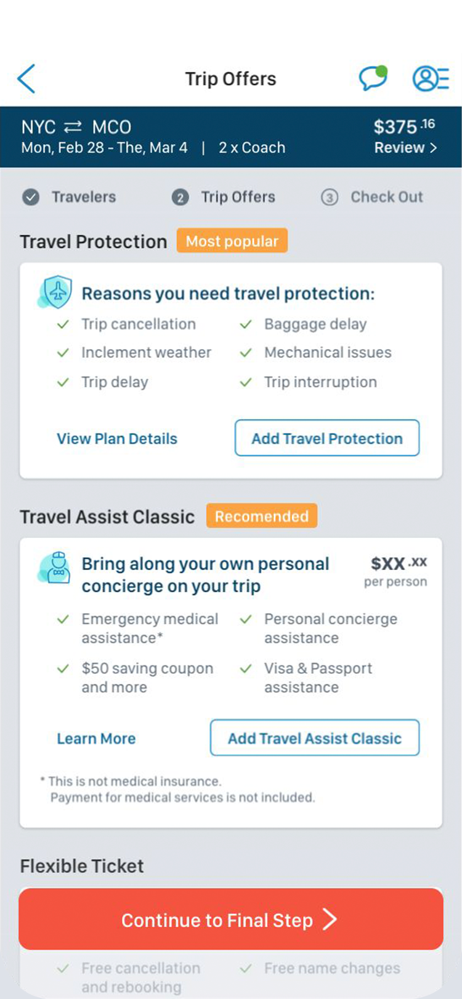
      <figcaption>Fig.9: Booking screen - 2</figcaption>
    </figure>
    <figure class="project-content__figure">
      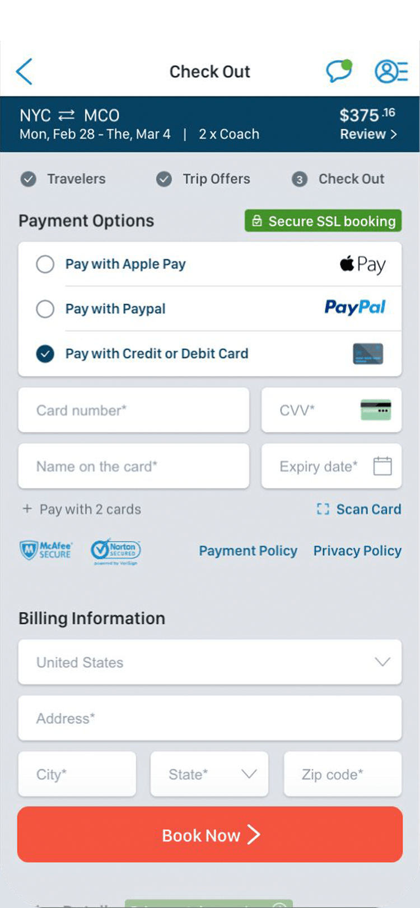
      <figcaption>Fig.10: Booking screen - 3</figcaption>
    </figure>
  

  

    <header class="content-section__header">
      <h3 class="h3">Hand-off</h3>
    </header>
    <dl>
      <dt>Interaction flow</dt>
      <dd>
        <ul class="bulleted-list">
          <li>To visualize user’s interaction flow to help product developers overviewing final UX flow.</li>
          <li>This helps whole product team to oversee the end-to-end production process.</li>
          <li><a href="https://drive.google.com/file/d/1iUmO8cvOSaRnQ8G23JabEXbDDcl-2Yz6/view" target="_blank" rel="noreferrer" class="text-sm text-gray-600">Enlarge image</a></li>
        </ul>
      </dd>
    </dl>
  

  

    <figure class="project-content__figure">
      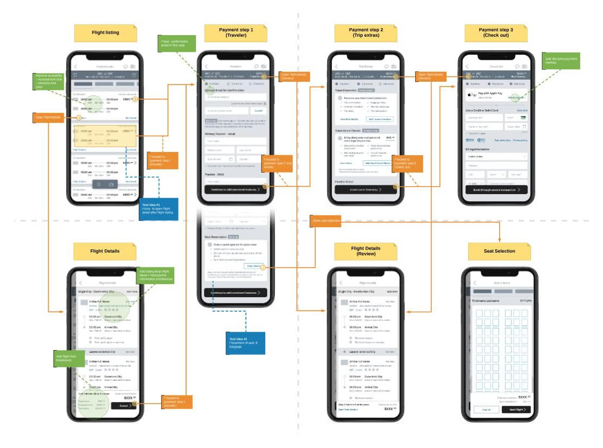
      <figcaption>Fig.7: Option C search view</figcaption>
    </figure>
  

  

    <header class="content-section__header">
      <h3 class="h3">Contribution</h3>
    </header>
    <dl class="project-content__card">
      <dt>Product strategy</dt>
      <dd>
        <ul class="bulleted-list">
          <li>Collaborating with product owner for setting the problem statement</li>
          <li>Holistic product UX review</li>
          <li>Setting product design strategy</li>
        </ul>
      </dd>
      <dt>UX design</dt>
      <dd>
        <ul class="bulleted-list">
          <li>Collaborating with UX researcher on analyzing user feedback</li>
          <li>Create a wireframe with interaction flow</li>
        </ul>
      </dd>
      <dt>UI design</dt>
      <dd>
        <ul class="bulleted-list">
          <li>Creating a high-fidelity UI mock-up</li>
          <li>Creating an interactive prototype using Sketch and UXPin</li>
        </ul>
      </dd>
    </dl>
  

