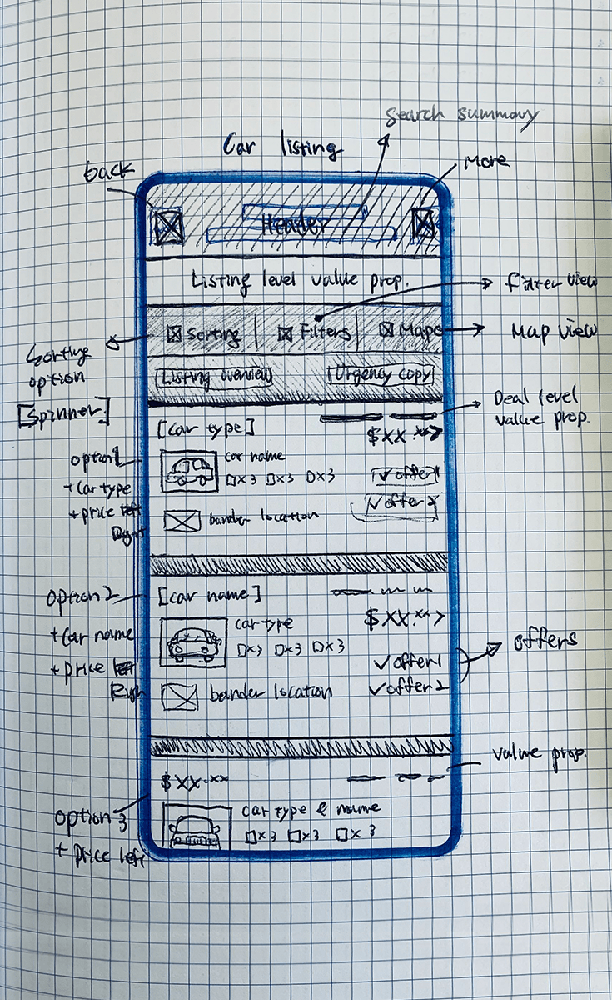
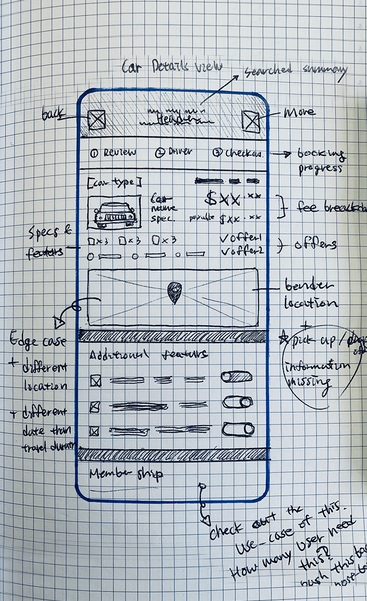
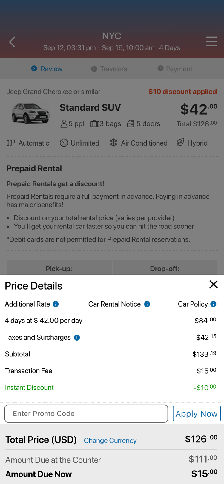

  

    <header class="content-section__header">
      <h3 class="h3">Project background</h3>
    </header>
    <dl>
      <dt>Product issue</dt>
      <dd>
        <ul class="bulleted-list">
          <li>Funnel decrease drastically</li>
          <li>Conversion is low</li>
        </ul>
      </dd>
      <dt>User Feedback Finding</dt>
      <dd>
        "I need to see more details to select the car..."
      </dd>
      <dt>Product goal</dt>
      <dd>
        <ul class="bulleted-list">
          <li>Increase listing - booking page funnel</li>
          <li>Reduce decision-making duration</li>
        </ul>
      </dd>
      <dt>Design challenge</dt>
      <dd>
        Keep visual consistency over different corner cases
      </dd>
    </dl>
  

  

    <figure class="project-content__figure">
      
      <figcaption>Fig.1: Listing screen</figcaption>
    </figure>
    <figure class="project-content__figure">
      
      <figcaption>Fig.2: Detail screen</figcaption>
    </figure>
  

  

    <header class="content-section__header">
      <h3 class="h3">Draft ideas</h3>
    </header>
    <dl>
      <dt>Listing (Fig.3)</dt>
      <dd>
        <ul class="bulleted-list">
          <li>Enhance layout of the listing card to align with design guideline</li>
          <li>Add critical information based on user feedback (e.g., car spec)</li>
        </ul>
      </dd>
      <dt>Detail (Fig.4)</dt>
      <dd>
        <ul class="bulleted-list">
          <li>Add secondary information (e.g., rental information)</li>
          <li>Add adjustable specs that might affect the price (i.e., users could review before the final decision)</li>
        </ul>
      </dd>
    </dl>
  

  

    <figure class="project-content__figure">
      
      <figcaption>Fig.3: Listing sketch</figcaption>
    </figure>
    <figure class="project-content__figure">
      
      <figcaption>Fig.4: Detail sketch</figcaption>
    </figure>
  

  

    <header class="content-section__header">
      <h3 class="h3">Diverge solutions</h3>
    </header>
    <dl>
    <dt>Information architecture</dt>
      <dd>
        <ul class="bulleted-list">
          <li>Listed out factors that would affect to decision making</li>
          <li>Segmentize tier of information</li>
        </ul>
      </dd>
      <dt>Wireframe</dt>
      <dd>
        <ul class="bulleted-list">
          <li>Utilize card layout with information segments</li>
          <li>Utilize tier segments to define interaction flow</li>
        </ul>
      </dd>
      <dt>Options</dt>
      <dd>
        <dl class="definition-list bulleted-list">
          <dt>Communication</dt>
          <dd>
            <ul>
              <li>Which pronoun would be more straightforward?</li>
              <li>Car model vs. car type</li>
            </ul>
          </dd>
          <dt>Interaction flow</dt>
          <dd>
            <ul>
              <li>What would be the right amount of commitment when users see the detail?</li>
              <li>Browsing vs. deciding</li>
            </ul>
          </dd>
        </dl>
      </dd>
    </dl>
    <a href="https://preview.uxpin.com/881796dcaf0e673af0260dbee9c2a9b5b392ca77#/pages/109030465/simulate/sitemap?mode=ch" target="_blank" rel="noreferrer" class="text-sm text-gray-600">Open wireframe</a>
  

  

    <figure class="project-content__figure">
      
      <figcaption>Fig.5: Listing wireframe</figcaption>
    </figure>
    <figure class="project-content__figure">
      
      <figcaption>Fig.6: Detail wireframe</figcaption>
    </figure>
  

  

    <header class="content-section__header">
      <h3 class="h3">Converge and Prototype</h3>
    </header>
    <dl>
      <dt>Converge solution</dt>
      <dd>
        <ul class="bulleted-list">
          <li>Use the car type to reduce surprise</li>
          <li>Using car type allows to use conversion-friendly labels.</li>
          <li>Place the detail view in the browsing path</li>
          <li>Users would decide after they check out the rental information.</li>
        </ul>
      </dd>
      <dt>Visual design</dt>
      <dd>
        <ul class="bulleted-list">
          <li>Update and utilize UI component for visual consistency</li>
          <li>Update icons and add a text label improve receptiveness</li>
        </ul>
      </dd>
      <dt>Business cases</dt>
      <dd>
        <ol class="ordered-list">
          <li>Distance check - map view (Fig.8)</li>
          <li>Rental details - different drop-off location (Fig.10)</li>
          <li>Upgrade - upsell options (Fig.12)</li>
        </ol>
      </dd>
    </dl>
    <a href="https://preview.uxpin.com/a158b33be496ec6632826186ca95f9a3a8af4eab#/pages/109030754/simulate/sitemap?mode=ch" target="_blank" rel="noreferrer" class="button button--ghost button--sm mt-4">Open interactive prototype</a>
  

  

    <figure class="project-content__figure">
      
      <figcaption>Fig.7: Listing screen</figcaption>
    </figure>
    <figure class="project-content__figure">
      
      <figcaption>Fig.8: Listing screen (map view)</figcaption>
    </figure>
    <figure class="project-content__figure">
      
      <figcaption>Fig.9: Detail screen</figcaption>
    </figure>
    <figure class="project-content__figure">
      
      <figcaption>Fig.10: Detail screen (diff. drop-off location)</figcaption>
    </figure>
    <figure class="project-content__figure">
      
      <figcaption>Fig.11: Detail screen (price details)</figcaption>
    </figure>
    <figure class="project-content__figure">
      
      <figcaption>Fig.12: Detail screen (upsell options)</figcaption>
    </figure>
  

  

    <header class="content-section__header">
      <h3 class="h3">Contribution</h3>
    </header>
    <dl class="project-content__card">
      <dt>Product strategy</dt>
      <dd>
        <ul class="bulleted-list">
          <li>Collaborating with the product owner to define the problem statement</li>
        </ul>
      </dd>
      <dt>UX design</dt>
      <dd>
        <ul class="bulleted-list">
          <li>Collect and analyze pain points</li>
          <li>Revisit information architecture and segmentize them</li>
          <li>Create a wireframe and flow</li>
        </ul>
      </dd>
      <dt>UI design</dt>
      <dd>
        <ul class="bulleted-list">
          <li>Creating a high-fidelity UI mock-up</li>
          <li>Update and utilize style guide / UI library</li>
          <li>Creating an interactive prototype using Sketch and UXPin</li>
        </ul>
      </dd>
    </dl>
  

