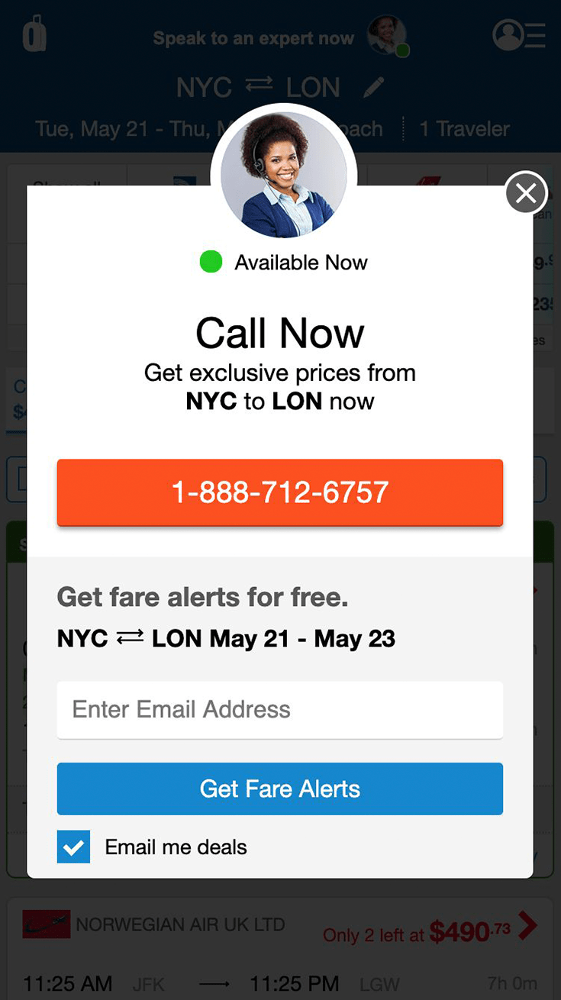
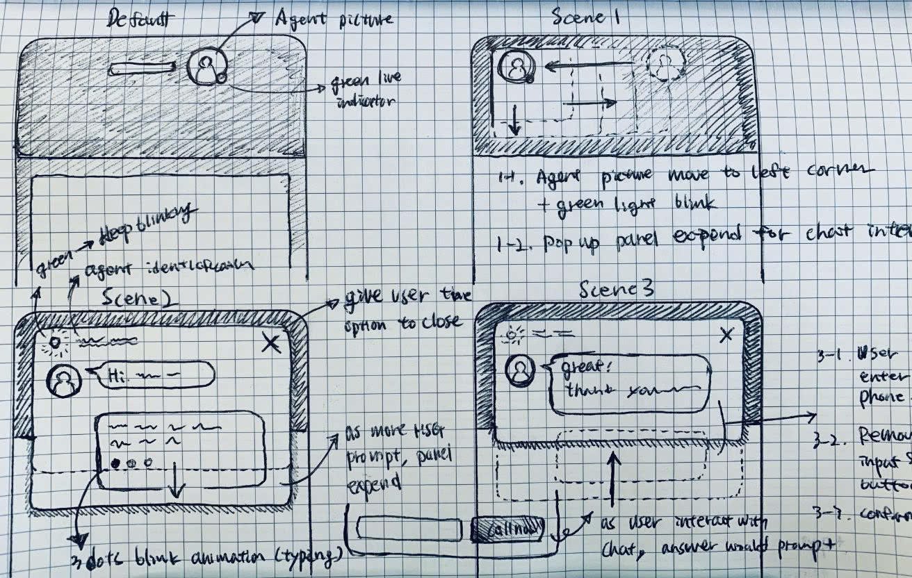

  

    <header class="content-section__header">
      <h3 class="h3">Project background</h3>
    </header>
    <dl>
      <dt>Product issue</dt>
      <dd>
        Users abandon the booking path after selecting the flight fron the listing
      </dd>
      <dt>User Test Finding</dt>
      <dd>
        "I already selected what I want. I expected some sign of the next step..."
      </dd>
      <dt>Product goal</dt>
      <dd>
        <ol class="ordered-list">
          <li>Increase flight search rate</li>
          <li>Reduce bounce rate</li>
        </ol>
      </dd>
      <dt>Design challenge</dt>
      <dd>
        Spare the space for post-booking and marketing components
      </dd>
    </dl>
  

  

    <figure class="project-content__figure">
      
      <figcaption>Fig.1: Listing screen</figcaption>
    </figure>
    <figure class="project-content__figure">
      
      <figcaption>Fig.2: Review screen</figcaption>
    </figure>
  

  

    <header class="content-section__header">
      <h3 class="h3">Draft ideas</h3>
    </header>
    <dl>
      <dt>Interaction flow</dt>
      <dd>
        <ul class="bulleted-list">
          <li>To visualize user’s interaction flow to help product developers overviewing final UX flow.</li>
          <li>This helps developers and QAs to overview end-to-end product process.</li>
          <li><a href="https://drive.google.com/file/d/1e4CmK73HWg_kwraxP7-GWWBLrzHwWX0L/view" target="_blank" rel="noreferrer" class="text-sm text-gray-600">Enlarge image</a></li>
        </ul>
      </dd>
    </dl>
  

  

    <figure class="project-content__figure">
      
      <figcaption>Fig.3: Option C search view</figcaption>
    </figure>
  

  

    <header class="content-section__header">
      <h3 class="h3">Draft interaction</h3>
    </header>
    <dl>
      <dt>Interaction flow</dt>
      <dd>
        <ul class="bulleted-list">
          <li>To visualize user’s interaction flow to help product developers overviewing final UX flow.</li>
          <li>This helps developers and QAs to overview end-to-end product process.</li>
          <li><a href="https://drive.google.com/file/d/1e4CmK73HWg_kwraxP7-GWWBLrzHwWX0L/view" target="_blank" rel="noreferrer" class="text-sm text-gray-600">Enlarge image</a></li>
        </ul>
      </dd>
    </dl>
  

  

    <figure class="project-content__figure project-content__figure--gif">
      
      <figcaption>Fig.3: Option C search view</figcaption>
    </figure>
  

  

    <dl>
      <dt>Interaction flow</dt>
      <dd>
        <ul class="bulleted-list">
          <li>To visualize user’s interaction flow to help product developers overviewing final UX flow.</li>
          <li>This helps developers and QAs to overview end-to-end product process.</li>
          <li><a href="https://drive.google.com/file/d/1e4CmK73HWg_kwraxP7-GWWBLrzHwWX0L/view" target="_blank" rel="noreferrer" class="text-sm text-gray-600">Enlarge image</a></li>
        </ul>
      </dd>
    </dl>
  

  

    <figure class="project-content__figure project-content__figure--gif">
      
      <figcaption>Fig.3: Option C search view</figcaption>
    </figure>
  

  

    <header class="content-section__header">
      <h3 class="h3">Build interactions</h3>
    </header>
    <dl>
      <dt>Option A</dt>
      <dd>
        <ul class="bulleted-list">
          <li>Full search + Extra component</li>
          <li>Users would miss additional context below the fold</li>
          <li><a href="https://projects.invisionapp.com/share/MPNTZTV9RHG#/screens/318101850" target="_blank" rel="noreferrer" class="text-sm text-gray-600">Open wireframe</a></li>
        </ul>
      </dd>
    </dl>
  

  

    <figure class="project-content__figure">
      
      <figcaption>Fig.3: Option A</figcaption>
    </figure>
    <figure class="project-content__figure">
      
      <figcaption>Fig.4: Option B</figcaption>
    </figure>
    <figure class="project-content__figure">
      
      <figcaption>Fig.5: Option B</figcaption>
    </figure>
    <figure class="project-content__figure">
      
      <figcaption>Fig.4: Option B</figcaption>
    </figure>
    <figure class="project-content__figure">
      
      <figcaption>Fig.4: Option B</figcaption>
    </figure>
  

  

      <dt>Option A</dt>
      <dd>
        <ul class="bulleted-list">
          <li>Full search + Extra component</li>
          <li>Users would miss additional context below the fold</li>
          <li><a href="https://projects.invisionapp.com/share/MPNTZTV9RHG#/screens/318101850" target="_blank" rel="noreferrer" class="text-sm text-gray-600">Open wireframe</a></li>
        </ul>
      </dd>
    </dl>
  

  

    <figure class="project-content__figure">
      
      <figcaption>Fig.4: Option B</figcaption>
    </figure>
    <figure class="project-content__figure">
      
      <figcaption>Fig.4: Option B</figcaption>
    </figure>
    <figure class="project-content__figure">
      
      <figcaption>Fig.4: Option B</figcaption>
    </figure>
  

  

    <header class="content-section__header">
      <h3 class="h3">Contribution</h3>
    </header>
    <dl class="project-content__card">
      <dt>Product strategy</dt>
      <dd>
        <ul class="bulleted-list">
          <li>Collaborating with product owner for setting the problem statement</li>
          <li>Setting product design strategy</li>
        </ul>
      </dd>
      <dt>UI design</dt>
      <dd>
        <ul class="bulleted-list">
          <li>Creating a high-fidelity UI mock-up</li>
          <li>Creating an interactive prototype using Sketch and UXPin</li>
        </ul>
      </dd>
      <dt>UX design</dt>
      <dd>
        <ul class="bulleted-list">
          <li>Collaborating with UX researcher on a benchmarking report and analyzing user behavior, traffic analysis</li>
          <li>Collaborating in interaction design to create a wireframe</li>
          <li>Generating an interaction flow and micro-interaction guide</li>
        </ul>
      </dd>
    </dl>
  

