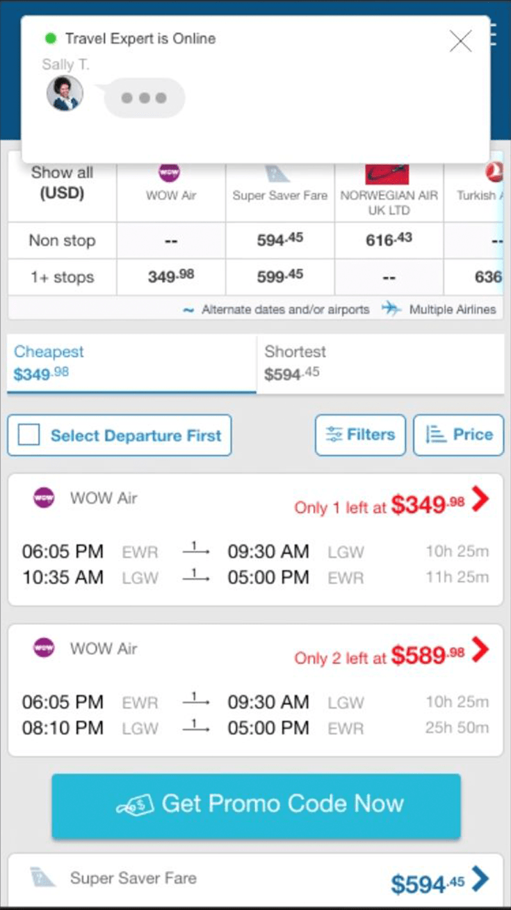
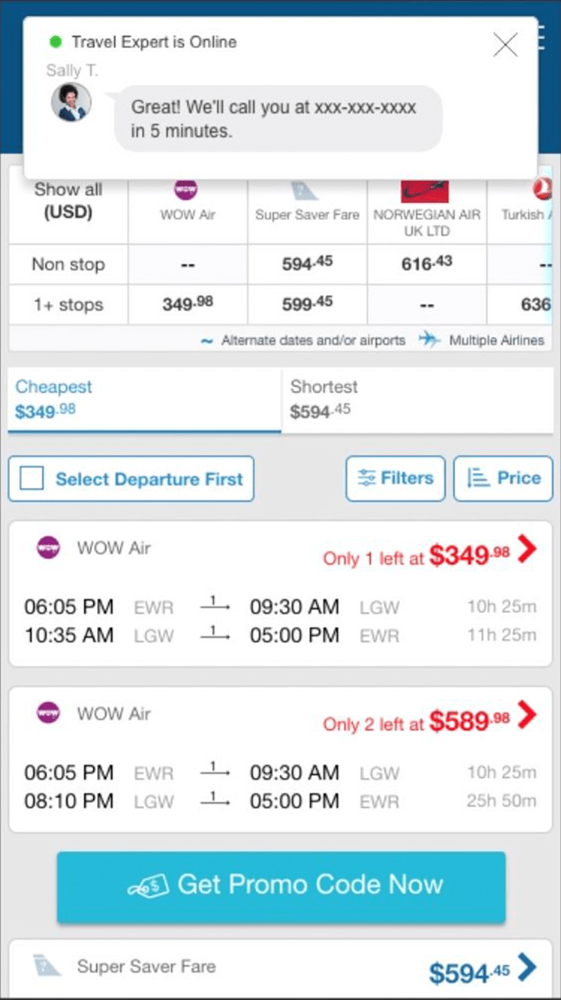

  

    <header class="content-section__header">
      <h3 class="h3">Project background</h3>
    </header>
    <dl>
      <dt>Product issue</dt>
      <dd>
        <ul class="bulleted-list">
          <li>Users are discouraged by the full-blocked dialog modal.</li>
          <li>The presentation is too aggressive, and the interaction is passive.</li>
        </ul>
      </dd>
      <dt>User Interview Quote</dt>
      <dd>
        <ul class="bulleted-list">
          <li>"I felt kicked-out..."</li>
          <li>"It's shutting me out instead of talking to me..."</li>
        </ul>
      </dd>
      <dt>Product goal</dt>
      <dd>
        <ul class="bulleted-list">
          <li>Increase customer retention from the listing</li>
        </ul>
      </dd>
      <dt>Design challenge</dt>
      <dd>
        Grab user's attention less aggressively
      </dd>
    </dl>
  

  

    <figure class="project-content__figure">
      
      <figcaption>Fig.1: Listing screen</figcaption>
    </figure>
    <figure class="project-content__figure">
      
      <figcaption>Fig.2: Inactive dialog</figcaption>
    </figure>
  

  

    <header class="content-section__header">
      <h3 class="h3">Draft ideas</h3>
    </header>
    <dl>
      <dt>Friendly interaction sequence</dt>
      <dd>
        <ul class="bulleted-list">
          <li>Mimicking the 'chat interaction' to present less aggressively</li>
          <li>Utilizing conversational sequence to deliver information actively</li>
        </ul>
      </dd>
    </dl>
  

  

    <figure class="project-content__figure">
      
      <figcaption>Fig.3: Idea sketch</figcaption>
    </figure>
  

  

    <header class="content-section__header">
      <h3 class="h3">Draft interaction</h3>
    </header>
    <dl>
      <dt>Humanly interaction</dt>
      <dd>
        <ul class="bulleted-list">
          <li>Utilize persona to make the whole engagement more friendly</li>
          <li>The conversational sequence would help breakdown the information into two way communication.</li>
          <li>This format has more room to slip conversion-friendly message.</li>
        </ul>
      </dd>
    </dl>
  

  

    <figure class="project-content__figure project-content__figure--gif">
      
      <figcaption>Fig.4: Engaging view</figcaption>
    </figure>
  

  

    <dl>
      <dt>Less input, more feedback</dt>
      <dd>
        <ul class="bulleted-list">
          <li>Reducing the input forms would help users to focus.</li>
          <li>Instead of forcing users to be smart, the feedback logic should improve to deal with corner cases.</li>
        </ul>
      </dd>
    </dl>
  

  

    <figure class="project-content__figure project-content__figure--gif">
      
      <figcaption>Fig.5: Feedback view</figcaption>
    </figure>
  

  

    <header class="content-section__header">
      <h3 class="h3">Build interactions and prototype</h3>
    </header>
    <a href="https://preview.uxpin.com/5754208e6b70ccd681b4bc7d96c2c6a3cf1c6169#/pages/109034717/simulate/sitemap?mode=ch" target="_blank" rel="noreferrer" class="button button--ghost button--sm mt-2 mb-8">Open interactive prototype</a>
    <dl>
      <dt>Engaging sequence</dt>
      <dd>
        <ul class="bulleted-list">
          <li>Green blinking indicates agent online</li>
          <li>Animating chat UI doesn't require to block out the whole page.</li>
          <li>The sequence would conclude with a single constructive action.</li>
        </ul>
      </dd>
    </dl>
  

  

    <figure class="project-content__figure">
      
      <figcaption>Fig.6: Engaging sequence 1</figcaption>
    </figure>
    <figure class="project-content__figure">
      
      <figcaption>Fig.7:  Engaging sequence 2</figcaption>
    </figure>
    <figure class="project-content__figure">
      
      <figcaption>Fig.8:  Engaging sequence 4</figcaption>
    </figure>
    <figure class="project-content__figure">
      
      <figcaption>Fig.9:  Engaging sequence 5</figcaption>
    </figure>
    <figure class="project-content__figure">
      
      <figcaption>Fig.10:  Engaging sequence 6</figcaption>
    </figure>
  

  

    <dl>
      <dt>Feedback sequence</dt>
      <dd>
        <ul class="bulleted-list">
          <li>Add conditional feedback to simulate conversation</li>
          <li>The chat is not necessarily stackable to keep the space minimum.</li>
          <li>Final feedback without previous conversation would give user the sign of 'DONE'.</li>
        </ul>
      </dd>
    </dl>
  

  

    <figure class="project-content__figure">
      
      <figcaption>Fig.11: Feedback sequence 1</figcaption>
    </figure>
    <figure class="project-content__figure">
      
      <figcaption>Fig.12: Feedback sequence 2</figcaption>
    </figure>
    <figure class="project-content__figure">
      
      <figcaption>Fig.13: Feedback sequence 3</figcaption>
    </figure>
  

  

    <header class="content-section__header">
      <h3 class="h3">Contribution</h3>
    </header>
    <dl class="project-content__card">
      <dt>Product strategy</dt>
      <dd>
        <ul class="bulleted-list">
          <li>Collaborating with product owner to set MVP strategy</li>
        </ul>
      </dd>
      <dt>UI design</dt>
      <dd>
        <ul class="bulleted-list">
          <li>Creating a low-fidelity mock for early validation</li>
          <li>Creating an interactive prototype using Sketch and UXPin</li>
        </ul>
      </dd>
      <dt>Front-end</dt>
      <dd>
        <ul class="bulleted-list">
          <li>Prototype the whole interaction with HTML/CSS and JS</li>
          <li>Implement MVP directly through A/B testing tool</li>
        </ul>
      </dd>
      <dt>UX design</dt>
      <dd>
        <ul class="bulleted-list">
          <li>Illustrate the persona to help product to shape the context of interaction</li>
          <li>Analyze traffic data and user interview result to address the pain points</li>
        </ul>
      </dd>
    </dl>
  

