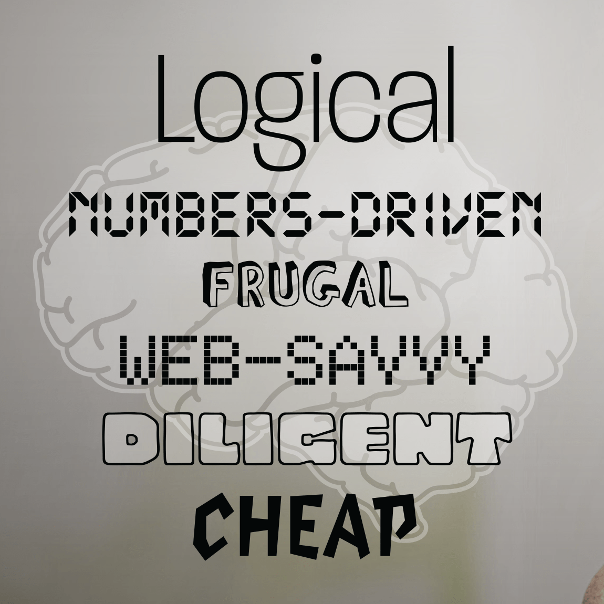

  

    <header class="content-section__header">
      <h3 class="h3">Project process</h3>
    </header>
    <dl>
      <dt>Collecting consumer data</dt>
      <dd>
        <ul class="bulleted-list">
          <li>External tools: CRM data collection, traffic analysis</li>
          <li>Internal mechanism: feedback collection, booking data, user interview</li>
        </ul>
      </dd>
      <dt>Data analysis</dt>
      <dd>
        <ul class="bulleted-list">
          <li>Sample size determination to segmentize consumer profiles</li>
          <li>Hypothesis testing/interview to breakdown behavior</li>
        </ul>
      </dd>
      <dt>Data visualization</dt>
      <dd>
        <ul class="bulleted-list">
          <li>Chart, illustration, and iconography</li>
        </ul>
      </dd>
    </dl>
  

  

    <figure class="project-content__figure pr-8 md:pr-56 lg:pr-16">
      
      <figcaption>Fig.1: Design process</figcaption>
    </figure>
  

  

    <header class="content-section__header">
      <h3 class="h3">Visualizing information</h3>
    </header>
    <dl>
      <dt>Supplementary visual</dt>
      <dd>
        <ul class="bulleted-list">
          <li>Putting the supplementary image to serve the context should deliver the information implicitly.</li>
          <li>This adds a specific meaning to the contents conclusively.</li>
          <li>This is an effective visualization method for the qualitative data.</li>
          <li>e.g., two different background images on two groups of keywords cloud (Fig.3, 4)</li>
        </ul>
      </dd>
    </dl>
  

  

    <figure class="project-content__figure -mr-8 -ml-8 md:-mr-12 md:-ml-12 lg:mr-0 lg:ml-0">
      
      <figcaption>Fig.2: Keywords cloud sketch</figcaption>
    </figure>
  

  

    <figure class="project-content__figure">
      
      <figcaption>Fig.3: Personality keywords - emotional</figcaption>
    </figure>
    <figure class="project-content__figure">
      
      <figcaption>Fig.4: Personality keywords - rational</figcaption>
    </figure>
  

  

    <dl>
      <dt>Data visualization</dt>
      <dd>
        <ul class="bulleted-list">
          <li>This method would serve quantitative data well.</li>
          <li>If the data represents a specific number, the chart will serve the purpose. e.g., a pie chart - Fig.6</li>
          <li>If the data represents a trend, visual could be more contextual. e.g., social media usage - Fig.7</li>
        </ul>
      </dd>
    </dl>
  

  

    <figure class="project-content__figure -mr-24 -ml-24 md:-mr-56 md:-ml-56 lg:mr-0">
      
      <figcaption>Fig.5: Data visualization sketch</figcaption>
    </figure>
  

  

    <figure class="project-content__figure">
      
      <figcaption>Fig.6: Example of data presentation i</figcaption>
    </figure>
    <figure class="project-content__figure">
      
      <figcaption>Fig.7: Example of data presentation ii</figcaption>
    </figure>
  

  

    <header class="content-section__header">
      <h3 class="h3">Final outcomes</h3>
    </header>
    <ul class="bulleted-list">
      <li>4 primary personas, 3 secondary personas, and 1 persona of potential consumer</li>
      <li>Printed and presented by hanging on all meeting areas</li>
      <li>Evangelize the whole team to specify persona in the product-related conversation</li>
    </ul>
  

  

    <figure class="project-content__figure">
      
      <figcaption>Fig.8: broke college student</figcaption>
    </figure>
    <figure class="project-content__figure">
      
      <figcaption>Fig.9: Happy retired couple</figcaption>
    </figure>
    <figure class="project-content__figure">
      
      <figcaption>Fig.10: Veteran concierge</figcaption>
    </figure>
    <figure class="project-content__figure">
      
      <figcaption>Fig.11: Young-super mom</figcaption>
    </figure>
    <figure class="project-content__figure">
      
      <figcaption>Fig.12: Outdated shopper</figcaption>
    </figure>
    <figure class="project-content__figure">
      
      <figcaption>Fig.13: Super organized recruiter</figcaption>
    </figure>
    <figure class="project-content__figure">
      
      <figcaption>Fig.14: Web-savvy accountant</figcaption>
    </figure>
    <figure class="project-content__figure">
      
      <figcaption>Fig.15: Military husband</figcaption>
    </figure>
  

  

    <header class="content-section__header">
      <h3 class="h3">Contribution</h3>
    </header>
    <dl class="project-content__card">
      <dt>Visual design</dt>
      <dd>
        <ul class="bulleted-list">
          <li>Directing overall visual concept and layout of the persona poster</li>
          <li>Curating and visualizing information to present consistently and intuitively</li>
          <li>Setting the color code strategy for segmentation</li>
        </ul>
      </dd>
      <dt>UX research</dt>
      <dd>
        <ul class="bulleted-list">
          <li>Collaborating with UX researcher analyzing consumer data</li>
          <li>Collaborating with UX researcher searching internal data collection</li>
        </ul>
      </dd>
    </dl>
  

