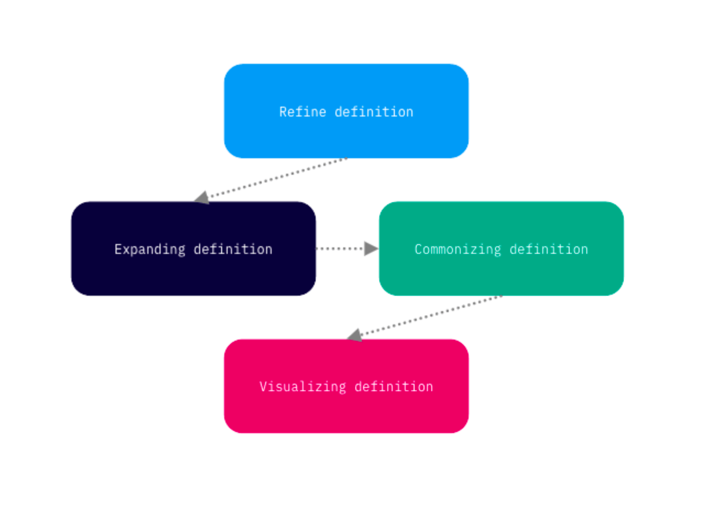
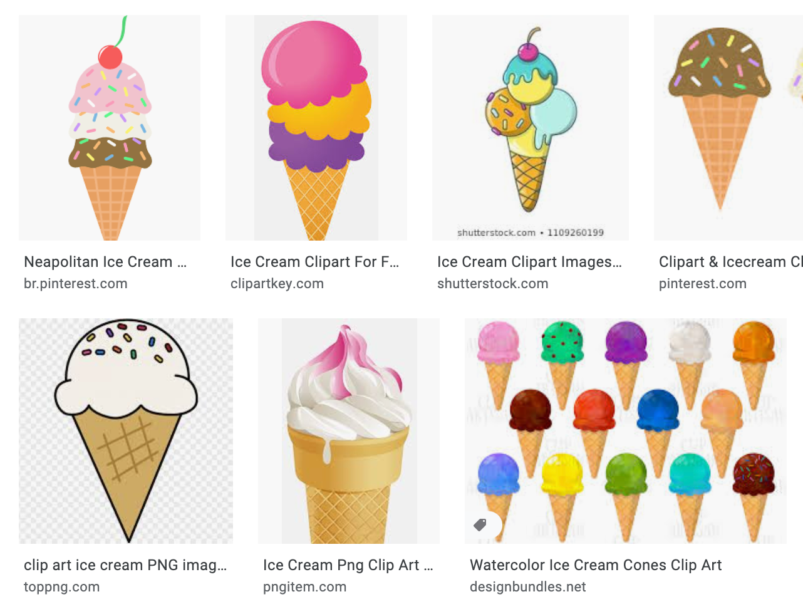

  

    <header class="content-section__header">
      <h3 class="h3">Design process</h3>
    </header>
    <dl>
      <dt>Collecting consumer data</dt>
      <dd>
        <ol class="bulleted-list">
          <li>Increase flight search rate</li>
          <li>Reduce bounce rate</li>
        </ol>
      </dd>
      <dt>Data analysis</dt>
      <dd>
        <ol class="bulleted-list">
          <li>Sample Size Determination</li>
          <li>Hypothesis Testing</li>
        </ol>
      </dd>
      <dt>Data visualization</dt>
      <dd>
        <ol class="bulleted-list">
          <li>Sample Size Determination</li>
          <li>Hypothesis Testing</li>
        </ol>
      </dd>
    </dl>
  

  

    <figure class="project-content__figure -ml-8 -mr-8 md:-ml-32 md:-mr-12 lg:ml-0 lg:mr-0">
      
      <figcaption>Fig.1: Listing screen</figcaption>
    </figure>
  

  

    <figure class="project-content__figure">
      
      <figcaption>Fig.4: Option B</figcaption>
    </figure>
    <figure class="project-content__figure">
      
      <figcaption>Fig.4: Option B</figcaption>
    </figure>
    <figure class="project-content__figure">
      
      <figcaption>Fig.4: Option B</figcaption>
    </figure>
    <figure class="project-content__figure">
      
      <figcaption>Fig.4: Option B</figcaption>
    </figure>
    <figure class="project-content__figure">
      
      <figcaption>Fig.4: Option B</figcaption>
    </figure>
  

  

    <figure class="project-content__figure">
      
      <figcaption>Fig.4: Option B</figcaption>
    </figure>
    <figure class="project-content__figure">
      
      <figcaption>Fig.4: Option B</figcaption>
    </figure>
    <figure class="project-content__figure">
      
      <figcaption>Fig.4: Option B</figcaption>
    </figure>
    <figure class="project-content__figure">
      
      <figcaption>Fig.4: Option B</figcaption>
    </figure>
    <figure class="project-content__figure">
      
      <figcaption>Fig.4: Option B</figcaption>
    </figure>
    <figure class="project-content__figure">
      
      <figcaption>Fig.4: Option B</figcaption>
    </figure>
  

  

    <header class="content-section__header">
      <h3 class="h3">Noona's Ice Cream</h3>
    </header>
    <ul class="bulleted-list">
      <li>To visualize user’s interaction flow to help product developers overviewing final UX flow.</li>
      <li>This helps developers and QAs to overview end-to-end product process.</li>
      <li><a href="https://drive.google.com/file/d/1e4CmK73HWg_kwraxP7-GWWBLrzHwWX0L/view" target="_blank" rel="noreferrer" class="text-sm text-gray-600">Enlarge image</a></li>
    </ul>
  

  

    <figure class="project-content__figure -mr-8 -ml-8 md:-mr-12 md:-ml-12 lg:mr-0 lg:ml-0">
      
      <figcaption>Fig.3: Option C search view</figcaption>
    </figure>
  

  

    <header class="content-section__header">
      <h3 class="h3">HYPD</h3>
    </header>
    <ul class="bulleted-list">
      <li>To visualize user’s interaction flow to help product developers overviewing final UX flow.</li>
      <li>This helps developers and QAs to overview end-to-end product process.</li>
      <li><a href="https://drive.google.com/file/d/1e4CmK73HWg_kwraxP7-GWWBLrzHwWX0L/view" target="_blank" rel="noreferrer" class="text-sm text-gray-600">Enlarge image</a></li>
    </ul>
  

  

    <figure class="project-content__figure -mr-8 -ml-8 md:-mr-12 md:-ml-12 lg:mr-0 lg:ml-0">
      
      <figcaption>Fig.3: Option C search view</figcaption>
    </figure>
  

  

    <header class="content-section__header">
      <h3 class="h3">CheapOair</h3>
    </header>
    <ul class="bulleted-list">
      <li>To visualize user’s interaction flow to help product developers overviewing final UX flow.</li>
      <li>This helps developers and QAs to overview end-to-end product process.</li>
      <li><a href="https://drive.google.com/file/d/1e4CmK73HWg_kwraxP7-GWWBLrzHwWX0L/view" target="_blank" rel="noreferrer" class="text-sm text-gray-600">Enlarge image</a></li>
    </ul>
  

  

    <figure class="project-content__figure -mr-8 -ml-8 md:-mr-12 md:-ml-12 lg:mr-0 lg:ml-0">
      
      <figcaption>Fig.3: Option C search view</figcaption>
    </figure>
  

  

    <header class="content-section__header">
      <h3 class="h3">Daniel Mission Foundation</h3>
    </header>
    <ul class="bulleted-list">
      <li>To visualize user’s interaction flow to help product developers overviewing final UX flow.</li>
      <li>This helps developers and QAs to overview end-to-end product process.</li>
      <li><a href="https://drive.google.com/file/d/1e4CmK73HWg_kwraxP7-GWWBLrzHwWX0L/view" target="_blank" rel="noreferrer" class="text-sm text-gray-600">Enlarge image</a></li>
    </ul>
  

  

    <figure class="project-content__figure -mr-8 -ml-8 md:-mr-12 md:-ml-12 lg:mr-0 lg:ml-0">
      
      <figcaption>Fig.3: Option C search view</figcaption>
    </figure>
  

  

    <header class="content-section__header">
      <h3 class="h3">E-bean design</h3>
    </header>
    <ul class="bulleted-list">
      <li>To visualize user’s interaction flow to help product developers overviewing final UX flow.</li>
      <li>This helps developers and QAs to overview end-to-end product process.</li>
      <li><a href="https://drive.google.com/file/d/1e4CmK73HWg_kwraxP7-GWWBLrzHwWX0L/view" target="_blank" rel="noreferrer" class="text-sm text-gray-600">Enlarge image</a></li>
    </ul>
  

  

    <figure class="project-content__figure -mr-8 -ml-8 md:-mr-12 md:-ml-12 lg:mr-0 lg:ml-0">
      
      <figcaption>Fig.3: Option C search view</figcaption>
    </figure>
  

  

    <header class="content-section__header">
      <h3 class="h3">Manhattan aquariums</h3>
    </header>
    <ul class="bulleted-list">
      <li>To visualize user’s interaction flow to help product developers overviewing final UX flow.</li>
      <li>This helps developers and QAs to overview end-to-end product process.</li>
      <li><a href="https://drive.google.com/file/d/1e4CmK73HWg_kwraxP7-GWWBLrzHwWX0L/view" target="_blank" rel="noreferrer" class="text-sm text-gray-600">Enlarge image</a></li>
    </ul>
  

  

    <figure class="project-content__figure -mr-8 -ml-8 md:-mr-12 md:-ml-12 lg:mr-0 lg:ml-0">
      
      <figcaption>Fig.3: Option C search view</figcaption>
    </figure>
  

  

    <header class="content-section__header">
      <h3 class="h3">Gelato vero</h3>
    </header>
    <ul class="bulleted-list">
      <li>To visualize user’s interaction flow to help product developers overviewing final UX flow.</li>
      <li>This helps developers and QAs to overview end-to-end product process.</li>
      <li><a href="https://drive.google.com/file/d/1e4CmK73HWg_kwraxP7-GWWBLrzHwWX0L/view" target="_blank" rel="noreferrer" class="text-sm text-gray-600">Enlarge image</a></li>
    </ul>
  

  

    <figure class="project-content__figure -mr-8 -ml-8 md:-mr-12 md:-ml-12 lg:mr-0 lg:ml-0">
      
      <figcaption>Fig.3: Option C search view</figcaption>
    </figure>
  

  

    <header class="content-section__header">
      <h3 class="h3">Ninja's Black Savory</h3>
    </header>
    <ul class="bulleted-list">
      <li>To visualize user’s interaction flow to help product developers overviewing final UX flow.</li>
      <li>This helps developers and QAs to overview end-to-end product process.</li>
      <li><a href="https://drive.google.com/file/d/1e4CmK73HWg_kwraxP7-GWWBLrzHwWX0L/view" target="_blank" rel="noreferrer" class="text-sm text-gray-600">Enlarge image</a></li>
    </ul>
  

  

    <figure class="project-content__figure -mr-8 -ml-8 md:-mr-12 md:-ml-12 lg:mr-0 lg:ml-0">
      
      <figcaption>Fig.3: Option C search view</figcaption>
    </figure>
  

  

    <header class="content-section__header">
      <h3 class="h3">Contribution</h3>
    </header>
    <dl class="project-content__card">
      <dt>Product strategy</dt>
      <dd>
        <ul class="bulleted-list">
          <li>Collaborating with product owner for setting the problem statement</li>
          <li>Setting product design strategy</li>
        </ul>
      </dd>
      <dt>UI design</dt>
      <dd>
        <ul class="bulleted-list">
          <li>Creating a high-fidelity UI mock-up</li>
          <li>Creating an interactive prototype using Sketch and UXPin</li>
        </ul>
      </dd>
      <dt>UX design</dt>
      <dd>
        <ul class="bulleted-list">
          <li>Collaborating with UX researcher on a benchmarking report and analyzing user behavior, traffic analysis</li>
          <li>Collaborating in interaction design to create a wireframe</li>
          <li>Generating an interaction flow and micro-interaction guide</li>
        </ul>
      </dd>
    </dl>
  

