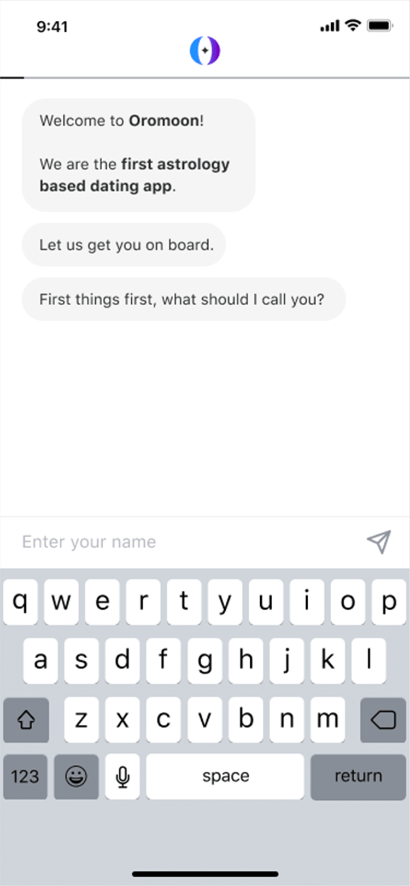
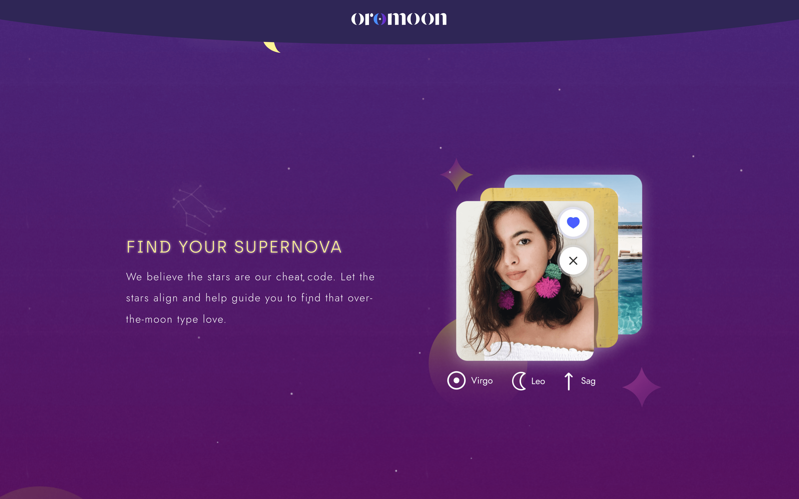

  

    <header class="content-section__header">
      <h3 class="h3">Project background</h3>
    </header>
    <dl>
      <dt>Problem statement</dt>
      <dd>
        Users abandon the booking path after selecting the flight fron the listing
      </dd>
      <dt>Sprint questions</dt>
      <dd>
        <ol class="ordered-list">
          <li>Increase flight search rate</li>
          <li>Reduce bounce rate</li>
        </ol>
      </dd>
      <dt>MVP goal</dt>
      <dd>
        <ol class="ordered-list">
          <li>Increase flight search rate</li>
          <li>Reduce bounce rate</li>
        </ol>
      </dd>
    </dl>
  

  

    <figure class="project-content__figure">
      
      <figcaption>Fig.2: Listing screen</figcaption>
    </figure>
    <figure class="project-content__figure lg:transform lg:-translate-x-8 lg:translate-y-20 lg:scale-150 xl:scale-125">
      
      <figcaption class="lg:transform lg:scale-75 xl:scale-90">Fig.1: Listing screen</figcaption>
    </figure>
  

  

    <header class="content-section__header">
      <h3 class="h3">Diverge ideas</h3>
    </header>
    <dl>
      <dt>Option A</dt>
      <dd>
        <ul class="bulleted-list">
          <li>Full search + Extra component</li>
          <li>Users would miss additional context below the fold</li>
          <li><a href="https://projects.invisionapp.com/share/MPNTZTV9RHG#/screens/318101850" target="_blank" rel="noreferrer" class="text-sm text-gray-600">Open wireframe</a></li>
        </ul>
      </dd>
      <dt>Option B</dt>
      <dd>
        <ul class="bulleted-list">
          <li>Minimal search bar to save more space</li>
          <li>User wouldn't associate the minimal search bar UI with the concept of travel search</li>
          <li><a href="https://projects.invisionapp.com/share/MPNTZTV9RHG#/screens/317587837" target="_blank" rel="noreferrer" class="text-sm text-gray-600">Open wireframe</a></li>
        </ul>
      </dd>
    </dl>
  

  

    <figure class="project-content__figure">
      
      <figcaption>Fig.3: Option A</figcaption>
    </figure>
    <figure class="project-content__figure">
      
      <figcaption>Fig.4: Option B</figcaption>
    </figure>
    <figure class="project-content__figure">
      
      <figcaption>Fig.4: Option B</figcaption>
    </figure>
    <figure class="project-content__figure">
      
      <figcaption>Fig.4: Option B</figcaption>
    </figure>
  

  

    <dl>
      <dt>Critical path</dt>
      <dd>
        <ul class="bulleted-list">
          <li>Minimal search bar to save more space</li>
          <li>User wouldn't associate the minimal search bar UI with the concept of travel search</li>
        </ul>
      </dd>
    </dl>
  

  

    <figure class="project-content__figure -mr-8 -ml-8 md:-mr-12 md:-ml-12 lg:mr-0 lg:ml-0">
      
      <figcaption>Fig.3: Option C search view</figcaption>
    </figure>
  

  

    <header class="content-section__header">
      <h3 class="h3">Converge solutions</h3>
    </header>
    <dl>
      <dt>Option C</dt>
      <dd>
        <ul class="bulleted-list">
          <li>Keep the two main context(search vs other components) in balance</li>
          <li>Visualize the concept of travel (point a to point b)</li>
          <li>Expose additional components below the search</li>
        </ul>
      </dd>
      <dt>Option C</dt>
      <dd>
        <ul class="bulleted-list">
          <li>Keep the two main context(search vs other components) in balance</li>
          <li>Visualize the concept of travel (point a to point b)</li>
          <li>Expose additional components below the search</li>
        </ul>
      </dd>
    </dl>
  

  

    <figure class="project-content__figure">
      
      <figcaption>Fig.5: Option C</figcaption>
    </figure>
    <figure class="project-content__figure">
      
      <figcaption>Fig.5: Option C</figcaption>
    </figure>
    <figure class="project-content__figure">
      
      <figcaption>Fig.5: Option C</figcaption>
    </figure>
    <figure class="project-content__figure">
      
      <figcaption>Fig.5: Option C</figcaption>
    </figure>
    <figure class="project-content__figure">
      
      <figcaption>Fig.5: Option C</figcaption>
    </figure>
    <figure class="project-content__figure">
      
      <figcaption>Fig.5: Option C</figcaption>
    </figure>
    <figure class="project-content__figure">
      
      <figcaption>Fig.5: Option C</figcaption>
    </figure>
  

  

    <dl>
      <dt>Assumptions Board</dt>
      <dd>
        <ul class="bulleted-list">
          <li>Minimal search bar to save more space</li>
          <li>User wouldn't associate the minimal search bar UI with the concept of travel search</li>
        </ul>
      </dd>
    </dl>
  

  

    <figure class="project-content__figure -mr-8 -ml-8 md:-mr-12 md:-ml-12 lg:mr-0 lg:ml-0">
      
      <figcaption>Fig.3: Option C search view</figcaption>
    </figure>
  

  

    <header class="content-section__header">
      <h3 class="h3">Prototype</h3>
    </header>
    <dl>
      <dt>Onboading</dt>
      <dd>
        <ul class="bulleted-list">
          <li>Keep the two main context(search vs other components) in balance</li>
          <li>Visualize the concept of travel (point a to point b)</li>
          <li>Expose additional components below the search</li>
        </ul>
      </dd>
    </dl>
  

  

    <figure class="project-content__figure">
      
      <figcaption>Fig.5: Option C</figcaption>
    </figure>
    <figure class="project-content__figure">
      
      <figcaption>Fig.5: Option C</figcaption>
    </figure>
    <figure class="project-content__figure">
      
      <figcaption>Fig.5: Option C</figcaption>
    </figure>
    <figure class="project-content__figure">
      
      <figcaption>Fig.5: Option C</figcaption>
    </figure>
    <figure class="project-content__figure">
      
      <figcaption>Fig.5: Option C</figcaption>
    </figure>
  

  

    <dl>
      <dt>Chat with match</dt>
      <dd>
        <ul class="bulleted-list">
          <li>Keep the two main context(search vs other components) in balance</li>
          <li>Visualize the concept of travel (point a to point b)</li>
          <li>Expose additional components below the search</li>
        </ul>
      </dd>
    </dl>
  

  

    <figure class="project-content__figure">
      
      <figcaption>Fig.5: Option C</figcaption>
    </figure>
    <figure class="project-content__figure">
      
      <figcaption>Fig.5: Option C</figcaption>
    </figure>
    <figure class="project-content__figure">
      
      <figcaption>Fig.5: Option C</figcaption>
    </figure>
    <figure class="project-content__figure">
      
      <figcaption>Fig.5: Option C</figcaption>
    </figure>
    <figure class="project-content__figure">
      
      <figcaption>Fig.5: Option C</figcaption>
    </figure>
  

  

    <header class="content-section__header">
      <h3 class="h3">Art directing</h3>
    </header>
    <dl>
      <dt>Key conceptual words</dt>
      <dd>
        <ul class="bulleted-list">
          <li>Minimal search bar to save more space</li>
          <li>User wouldn't associate the minimal search bar UI with the concept of travel search</li>
        </ul>
      </dd>
      <dt>Mood board</dt>
      <dd>
        <ul class="bulleted-list">
          <li>Minimal search bar to save more space</li>
          <li>User wouldn't associate the minimal search bar UI with the concept of travel search</li>
        </ul>
      </dd>
    </dl>
  

  

    <figure class="project-content__figure -mr-8 -ml-8 md:-mr-12 md:-ml-12 lg:mr-0 lg:ml-0">
      
      <figcaption>Fig.3: Option C search view</figcaption>
    </figure>
  

  

    <dl>
      <dt>Concept illustration</dt>
      <dd>
        <ul class="bulleted-list">
          <li>Keep the two main context(search vs other components) in balance</li>
          <li>Visualize the concept of travel (point a to point b)</li>
          <li>Expose additional components below the search</li>
        </ul>
      </dd>
    </dl>
  

  

    <figure class="project-content__figure">
      
      <figcaption>Fig.5: Option C</figcaption>
    </figure>
    <figure class="project-content__figure">
      
      <figcaption>Fig.5: Option C</figcaption>
    </figure>
    <figure class="project-content__figure">
      
      <figcaption>Fig.5: Option C</figcaption>
    </figure>
  

  

    <header class="content-section__header">
      <h3 class="h3">Implementation</h3>
    </header>
    <dl>
      <dt>Landing page</dt>
      <dd>
        <ul class="bulleted-list">
          <li>Keep the two main context(search vs other components) in balance</li>
          <li>Visualize the concept of travel (point a to point b)</li>
          <li>Expose additional components below the search</li>
        </ul>
      </dd>
    </dl>
  

  

    <figure class="project-content__figure">
      
      <figcaption>Fig.5: Option C</figcaption>
    </figure>
    <figure class="project-content__figure">
      
      <figcaption>Fig.5: Option C</figcaption>
    </figure>
    <figure class="project-content__figure">
      
      <figcaption>Fig.5: Option C</figcaption>
    </figure>
    <figure class="project-content__figure">
      
      <figcaption>Fig.5: Option C</figcaption>
    </figure>
    <figure class="project-content__figure">
      
      <figcaption>Fig.5: Option C</figcaption>
    </figure>
    <figure class="project-content__figure">
      
      <figcaption>Fig.5: Option C</figcaption>
    </figure>
  

  

    <header class="content-section__header">
      <h3 class="h3">Contribution</h3>
    </header>
    <dl class="project-content__card">
      <dt>Product strategy</dt>
      <dd>
        <ul class="bulleted-list">
          <li>Collaborating with product owner for setting the problem statement</li>
          <li>Setting product design strategy</li>
        </ul>
      </dd>
      <dt>UI design</dt>
      <dd>
        <ul class="bulleted-list">
          <li>Creating a high-fidelity UI mock-up</li>
          <li>Creating an interactive prototype using Sketch and UXPin</li>
        </ul>
      </dd>
      <dt>UX design</dt>
      <dd>
        <ul class="bulleted-list">
          <li>Collaborating with UX researcher on a benchmarking report and analyzing user behavior, traffic analysis</li>
          <li>Collaborating in interaction design to create a wireframe</li>
          <li>Generating an interaction flow and micro-interaction guide</li>
        </ul>
      </dd>
    </dl>
  

