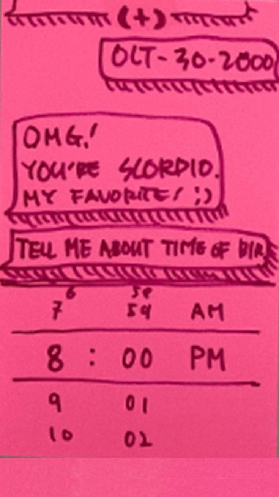
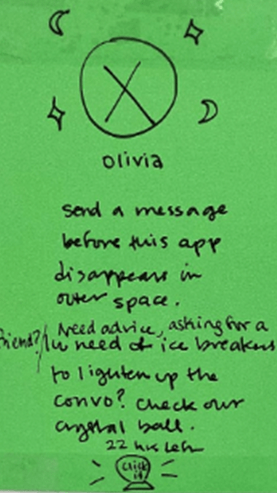
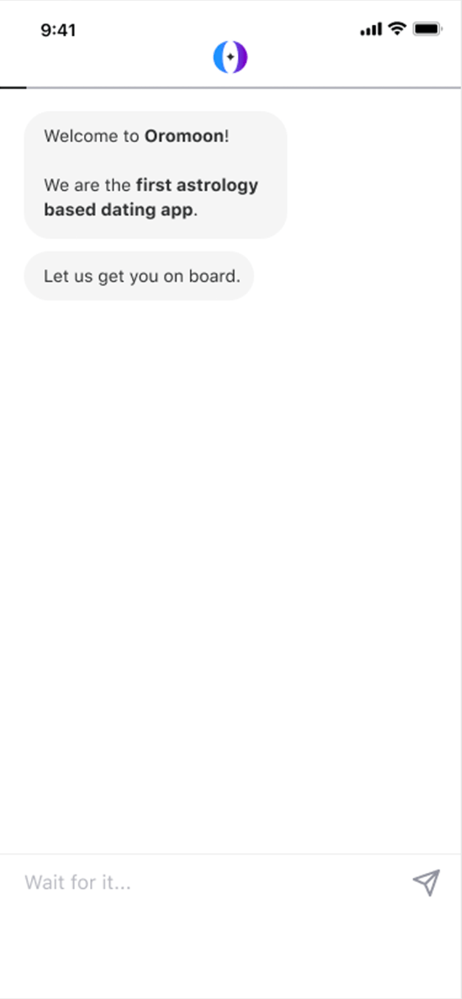
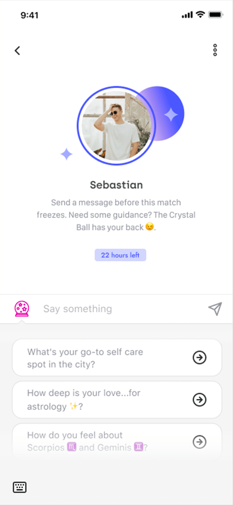
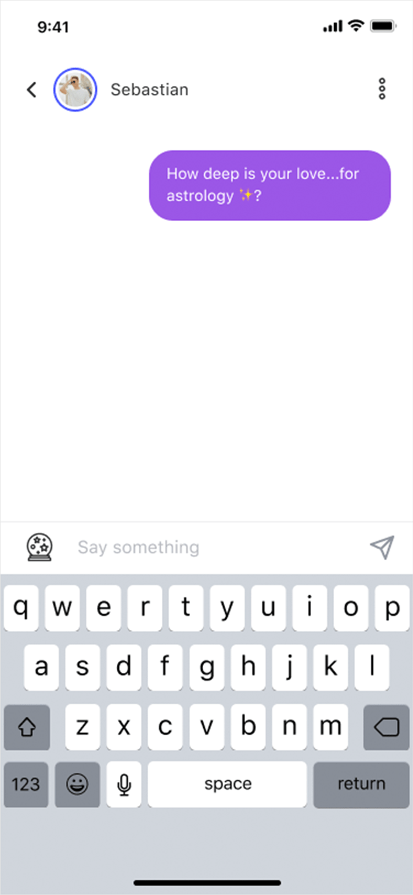
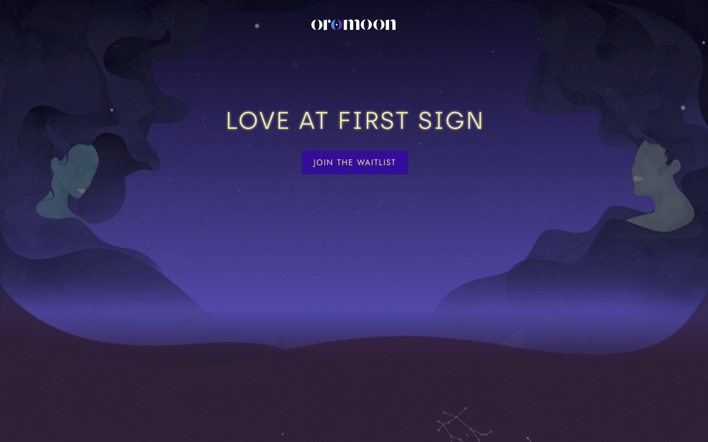

  

    <header class="content-section__header">
      <h3 class="h3">Project background</h3>
    </header>
    <dl>
      <dt>Problem statement</dt>
      <dd>
        People are having a hard time finding their perfect match (romantic) and want a new way to inform their decision-making process.
      </dd>
      <dt>Sprint questions</dt>
      <dd>
        <ol class="ordered-list">
          <li>How important to simplify the onboarding process to have more people to jump on?</li>
          <li>How useful to have a virtual wing-man(woman) while people have a conversation with their matches?</li>
        </ol>
      </dd>
      <dt>MVP goal</dt>
      <dd>
        <ol class="ordered-list">
          <li>Introduce astrology aspect early in the process</li>
          <li>Simplify the onboarding process</li>
          <li>Implement a conversation tip helper seamlessly</li>
        </ol>
      </dd>
    </dl>
  

  

    <figure class="project-content__figure">
      
      <figcaption>Fig.2: Sprint process</figcaption>
    </figure>
    <figure class="project-content__figure lg:transform lg:-translate-x-8 lg:translate-y-20 lg:scale-150 xl:scale-125">
      
      <figcaption class="lg:transform lg:scale-75 xl:scale-90">Fig.1: General process</figcaption>
    </figure>
  

  

    <header class="content-section__header">
      <h3 class="h3">Understand points and diverge ideas</h3>
    </header>
    <dl>
      <dt>Onboarding Process</dt>
      <dd>
        <ul class="bulleted-list">
          <li>Too many steps to go through</li>
          <li>The onboarding process is generally tasteless</li>
          <li>One way street communication - users don’t see any positive feedback until they finished</li>
        </ul>
      </dd>
      <dt>Chatting with a Match</dt>
      <dd>
        <ul class="bulleted-list">
          <li>Talking some you just met isn’t easy</li>
          <li>The conversation starter/aid might be useful - e.g., icebreaker</li>
        </ul>
      </dd>
    </dl>
  

  

    <figure class="project-content__figure">
      
      <figcaption>Fig.3: Idea sketch and vote 1</figcaption>
    </figure>
    <figure class="project-content__figure">
      
      <figcaption>Fig.4: Idea sketch and vote 2</figcaption>
    </figure>
    <figure class="project-content__figure">
      
      <figcaption>Fig.5: Idea sketch and vote 3</figcaption>
    </figure>
    <figure class="project-content__figure">
      
      <figcaption>Fig.6: Idea sketch and vote 4</figcaption>
    </figure>
  

  

    <header class="content-section__header">
      <h3 class="h3">Oversee user's journey</h3>
    </header>
    <dl>
      <dt>Critical path</dt>
      <dd>
        <ul class="bulleted-list">
          <li>Map out the overall flow of end-to-end user experience</li>
          <li>Use this to see the cause and effect flow in the step by step process</li>
          <li>Make sure those new ideas aligned with the final goal of users</li>
        </ul>
      </dd>
    </dl>
  

  

    <figure class="project-content__figure">
      
      <figcaption>Fig.7: Critical path</figcaption>
    </figure>
  

  

    <header class="content-section__header">
      <h3 class="h3">Converge solutions</h3>
    </header>
    <dl>
      <dt>Conversational onboarding process</dt>
      <dd>
        <ul class="bulleted-list inline-list">
          <li class="inline-list__item">Utilize chatting method</li>
          <li class="inline-list__item">Keep all input in one place</li>
          <li class="inline-list__item">Direct feedback</li>
          <li class="inline-list__item">Conversational interaction</li>
          <li class="inline-list__item">Share the taste of astrology aspect</li>
          <li class="inline-list__item">Shorten the interaction</li>
          <li class="inline-list__item">Minimize the requirement</li>
        </ul>
      </dd>
    </dl>
  

  

    <figure class="project-content__figure">
      
      <figcaption>Fig.8: Storyboard 1</figcaption>
    </figure>
    <figure class="project-content__figure">
      
      <figcaption>Fig.9: Storyboard 2</figcaption>
    </figure>
    <figure class="project-content__figure">
      
      <figcaption>Fig.10: Storyboard 3</figcaption>
    </figure>
    <figure class="project-content__figure">
      
      <figcaption>Fig.11: Storyboard 4</figcaption>
    </figure>
    <figure class="project-content__figure">
      
      <figcaption>Fig.12: Storyboard 5</figcaption>
    </figure>
  

  

    <dl>
      <dt>Crystal ball - conversation aid</dt>
      <dd>
        <ul class="bulleted-list inline-list">
            <li class="inline-list__item">Utilize personal information</li>
            <li class="inline-list__item">Add a gamification method</li>
            <li class="inline-list__item">AI-ish wing-man/woman?</li>
            <li class="inline-list__item">An icebreaker/chat starter kit</li>
            <li class="inline-list__item">Suggestion maker based on the match’s status</li>
        </ul>
      </dd>
    </dl>
  

  

    <figure class="project-content__figure">
      
      <figcaption>Fig.13: Storyboard 1</figcaption>
    </figure>
    <figure class="project-content__figure">
      
      <figcaption>Fig.13: Storyboard 2</figcaption>
    </figure>
    

  

  

    <header class="content-section__header">
      <h3 class="h3">Validation scenario</h3>
    </header>
    <dl>
      <dt>Assumptions Board</dt>
      <dd>
        <ul class="bulleted-list">
          <li>Breakdown sprint question align with sprint deliverables</li>
          <li>Add validation method e.g., prototype test, interview</li>
          <li>Add measurement of success</li>
        </ul>
      </dd>
    </dl>
  

  

    <figure class="project-content__figure">
      
      <figcaption>Fig.14: Sprint assumptions board</figcaption>
    </figure>
  

  

    <header class="content-section__header">
      <h3 class="h3">Prototype</h3>
    </header>
    <dl>
      <dt>Onboarding interaction</dt>
      <dd>
        <ul class="bulleted-list">
          <li>Mimic a ‘chatbot’ to demonstrate conversation</li>
          <li>Provide an astrological feedback during the process</li>
          <li>Minimize the interaction gap between the steps</li>
        </ul>
      </dd>
    </dl>
  

  

    <figure class="project-content__figure project-content__figure--gif">
      
      <figcaption>Fig.15: Interaction</figcaption>
    </figure>
    <figure class="project-content__figure">
      
      <figcaption>Fig.16: Interaction sequence 1</figcaption>
    </figure>
    <figure class="project-content__figure">
      
      <figcaption>Fig.17: Interaction sequence 2</figcaption>
    </figure>
    <figure class="project-content__figure">
      
      <figcaption>Fig.18: Interaction sequence 3</figcaption>
    </figure>
    <figure class="project-content__figure">
      
      <figcaption>Fig.19: Interaction sequence 4</figcaption>
    </figure>
  

  

    <dl>
      <dt>Chat with match</dt>
      <dd>
        <ul class="bulleted-list">
          <li>Add a conversation starter for ice-breaking</li>
          <li>Users can opt-out and switch back on as they need</li>
          <li>Keep the ‘crystal ball’ concept as a topic suggestion feature based on the match’s general information</li>
        </ul>
      </dd>
    </dl>
  

  

    <figure class="project-content__figure project-content__figure--gif">
      
      <figcaption>Fig.20: Interaction</figcaption>
    </figure>
    <figure class="project-content__figure">
      
      <figcaption>Fig.21: Interaction sequence 1</figcaption>
    </figure>
    <figure class="project-content__figure">
      
      <figcaption>Fig.22: Interaction sequence 2</figcaption>
    </figure>
    <figure class="project-content__figure">
      
      <figcaption>Fig.23: Interaction sequence 3</figcaption>
    </figure>
    <figure class="project-content__figure">
      
      <figcaption>Fig.24: Interaction sequence 4</figcaption>
    </figure>
  

  

    <header class="content-section__header">
      <h3 class="h3">Art directing</h3>
    </header>
    <dl>
      <dt>Key conceptual words</dt>
      <dd>
        <ul class="bulleted-list">
          <li>Moon > moon sign > night > Arabian night</li>
          <li>Stars > starry night > dark > dark hair</li>
        </ul>
      </dd>
      <dt>Mood board</dt>
      <dd>
        <ul class="bulleted-list">
          <li>Collecting visual concept based on keywords tree</li>
          <li>Utilize image search tools to validate the common acceptance of visual concepts</li>
          <li>A mood board can be a good guideline for a color pallet</li>
        </ul>
      </dd>
    </dl>
  

  

    <figure class="project-content__figure -mr-8 -ml-8 md:-mr-12 md:-ml-12 lg:mr-0 lg:ml-0">
      
      <figcaption>Fig.25: Mood board</figcaption>
    </figure>
  

  

    <dl>
      <dt>Concept illustration</dt>
      <dd>
        <ul class="bulleted-list">
          <li>Hand-drew concept sketch for early validation (Fig.27)</li>
          <li>Vectorize illustration</li>
        </ul>
      </dd>
    </dl>
  

  

    <figure class="project-content__figure project-content__figure--gif">
      
      <figcaption>Fig.26: Vectorize image process</figcaption>
    </figure>
    <figure class="project-content__figure">
      
      <figcaption>Fig.27: Hand-drew sketch</figcaption>
    </figure>
    <figure class="project-content__figure project-content__figure--gif">
      
      <figcaption>Fig.28: Vectorize image process</figcaption>
    </figure>
  

  

    <header class="content-section__header">
      <h3 class="h3">Implementation</h3>
    </header>
    <dl>
      <dt>Landing page</dt>
      <dd>
        <ul class="bulleted-list">
          <li>SVG animation for starry night scene on hero section</li>
          <li>Parallax scrolling animation</li>
        </ul>
      </dd>
    </dl>
  

  

    <figure class="project-content__figure project-content__figure--gif">
      
      <figcaption>Fig.29: Scrolling animation</figcaption>
    </figure>
    <figure class="project-content__figure">
      
      <figcaption>Fig.30: Hero</figcaption>
    </figure>
    <figure class="project-content__figure">
      
      <figcaption>Fig.31: About</figcaption>
    </figure>
    <figure class="project-content__figure">
      
      <figcaption>Fig.32: How this works 1</figcaption>
    </figure>
    <figure class="project-content__figure">
      
      <figcaption>Fig.33: How this works 2</figcaption>
    </figure>
    <figure class="project-content__figure">
      
      <figcaption>Fig.34: How this works 3</figcaption>
    </figure>
  

  

    <header class="content-section__header">
      <h3 class="h3">Contribution</h3>
    </header>
    <dl class="project-content__card">
      <dt>Product strategy</dt>
      <dd>
        <ul class="bulleted-list">
          <li>Participate product sprint process to validate the business concept</li>
          <li>Refine the priority list with scoping workshop</li>
        </ul>
      </dd>
      <dt>UI / visual design</dt>
      <dd>
        <ul class="bulleted-list">
          <li>Creating a high-fidelity UI mock-up</li>
          <li>Creating an interactive prototype using Figma</li>
          <li>Directing overall visual concept</li>
          <li>Illustrate hero image and visual elements</li>
        </ul>
      </dd>
      <dt>UX design</dt>
      <dd>
        <ul class="bulleted-list">
          <li>Conduct user testing to validate the MVP concept</li>
        </ul>
      </dd>
    </dl>
  

