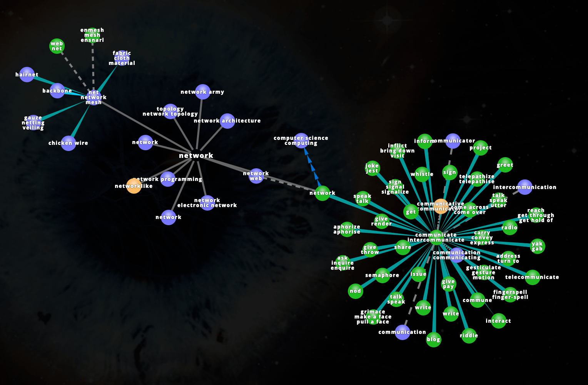

  

    <header class="content-section__header">
      <h3 class="h3">Project background</h3>
    </header>
    <dl>
      <dt>Project issue</dt>
      <dd>
        Unclear visual communication
      </dd>
      <dt>Project goal</dt>
      <dd>
        <ul class="bulleted-list">
          <li>Implement intuitive visual in hero section</li>
          <li>Improve visual communication to deliver core value</li>
        </ul>
      </dd>
    </dl>
  

  

    <figure class="project-content__figure pr-8 md:pr-4 lg:pr-8 xl:pr-0">
      
      <figcaption>Fig.1: Current hero image</figcaption>
    </figure>
  

  

    <header class="content-section__header">
      <h3 class="h3">Visual narrative</h3>
    </header>
    <dl>
      <dt>Conceptualize</dt>
      <dd>
        <ul class="bulleted-list">
          <li>Collect and expand keywords tree to deep dive into the core definition</li>
          <li>Handshake > acknowledge / network > communicate / public > communal</li>
        </ul>
      </dd>
    </dl>
  

  

    <figure class="project-content__figure">
      
      <figcaption>Fig.2: Word tree "handshake"</figcaption>
    </figure>
    <figure class="project-content__figure">
      
      <figcaption>Fig.3: Word tree "network"</figcaption>
    </figure>
    <figure class="project-content__figure">
      
      <figcaption>Fig.4: Word tree "public"</figcaption>
    </figure>
  

  

    <dl>
    <dt>Commonize</dt>
      <dd>
        <ul class="bulleted-list">
          <li>Collecting visual concept based on keywords tree and build a mood board</li>
          <li>Utilize image search tools to validate the common acceptance of visual concepts</li>
        </ul>
      </dd>
      <dt>Visualize</dt>
      <dd>
        <ul class="bulleted-list">
          <li>Hand-drew concept sketch for early validation</li>
          <li>Illustrate breakdown components</li>
        </ul>
      </dd>
    </dl>
  

  

    <figure class="project-content__figure">
      
      <figcaption>Fig.5: Mood board</figcaption>
    </figure>
    <figure class="project-content__figure">
      
      <figcaption>Fig.6: Sketch "network"</figcaption>
    </figure>
    <figure class="project-content__figure">
      
      <figcaption>Fig.7: Sketch "handshake"</figcaption>
    </figure>
    <figure class="project-content__figure">
      
      <figcaption>Fig.8: Sketch "Dome building"</figcaption>
    </figure>
  

  

    <header class="content-section__header">
      <h3 class="h3">Reify visual materials into a story</h3>
    </header>
    <dl>
      <dt>Concretize</dt>
      <dd>
        <ol class="ordered-list">
          <li>Build a whole scene with visual components</li>
          <li>Sketch and validate, repeat til team's happy</li>
          <li>Vectorize and colorize illustration</li>
        </ol>
      </dd>
    </dl>
  

  

    <figure class="project-content__figure">
      
      <figcaption>Fig.9: Composition sketch</figcaption>
    </figure>
    <figure class="project-content__figure">
      
      <figcaption>Fig.10: Vectorize</figcaption>
    </figure>
    <figure class="project-content__figure">
      
      <figcaption>Fig.11: Complete digitizing</figcaption>
    </figure>
  

  

    <figure class="project-content__figure">
      
      <figcaption>Fig.12: Final outcome and implementation</figcaption>
    </figure>
  

  

    <header class="content-section__header">
      <h3 class="h3">Contribution</h3>
    </header>
    <dl class="project-content__card">
      <dt>Visual design</dt>
      <dd>
        <ul class="bulleted-list">
          <li>Directing overall visual concept and layout</li>
          <li>Curating and visualizing information to present consistent look</li>
        </ul>
      </dd>
      <dt>UX research</dt>
      <dd>
        <ul class="bulleted-list">
          <li>Conduct UX interview and holistic UX review on current product to address pain points</li>
        </ul>
      </dd>
    </dl>
  

