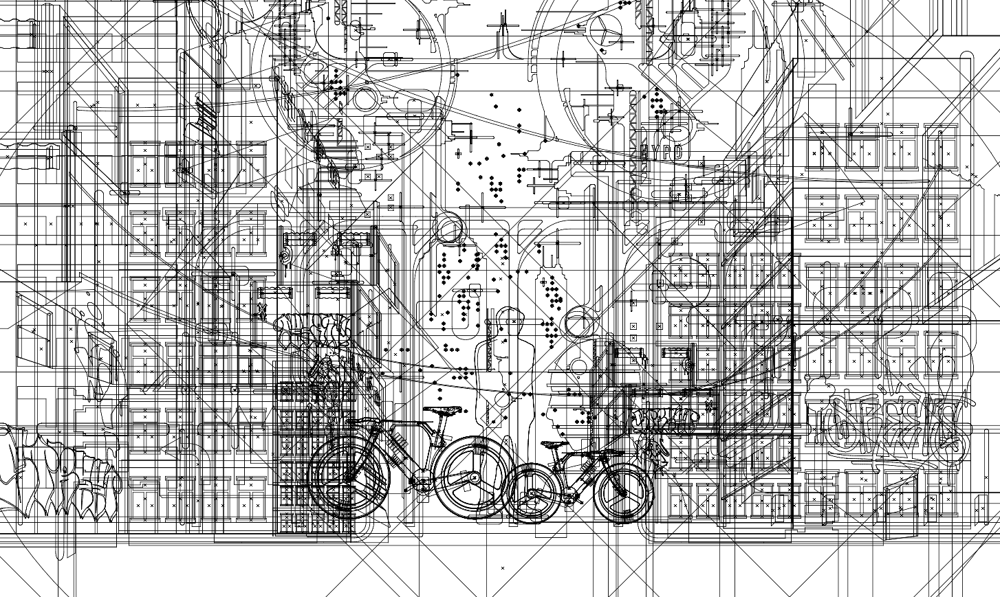
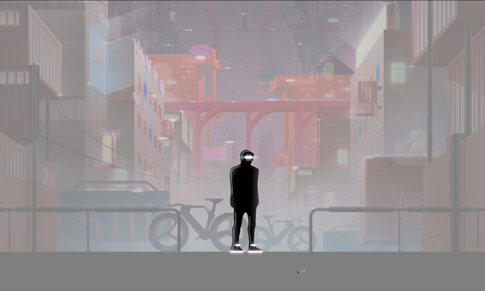
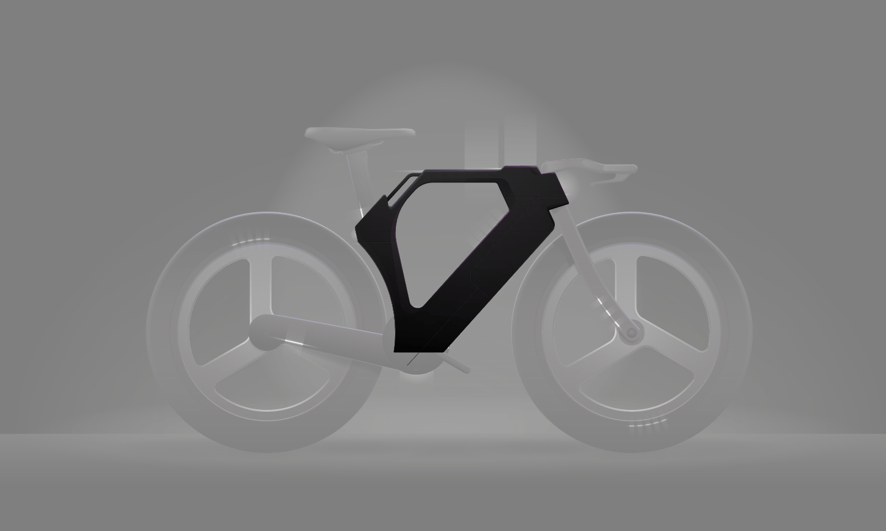
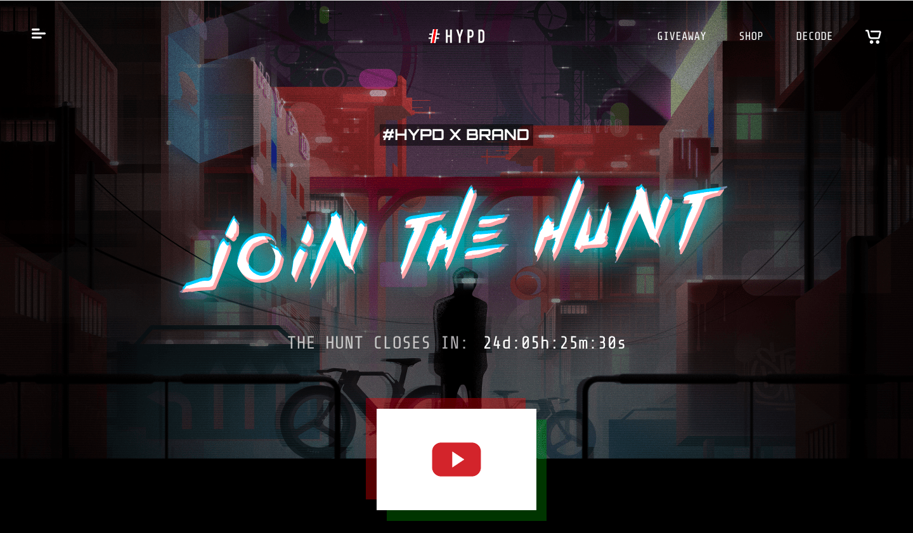
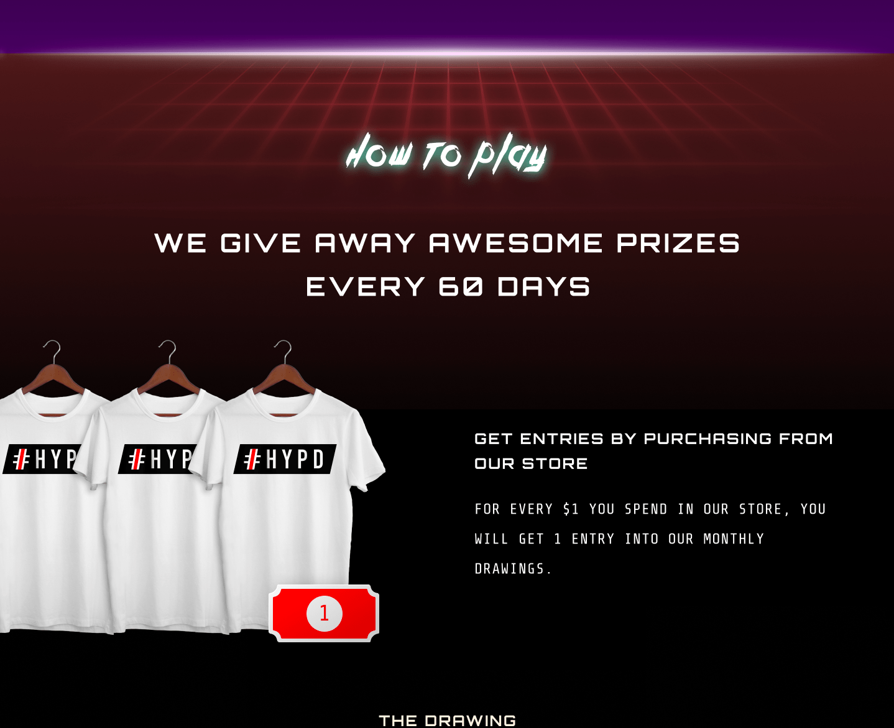

  

    <header class="content-section__header">
      <h3 class="h3">Brand sprint</h3>
    </header>
    <dl>
      <dt>Long-term road map</dt>
      <dd>
        <ol class="ordered-list">
          <li>Brand movement leader for new brands/existing brands to showcase/promote new product.</li>
          <li>All big marketing opportunities go through us now, brands and companies see us as a mandatory source of their marketing efforts.</li>
          <li>Leading millennial trend with product/service development away from core business</li>
        </ol>
      </dd>
      <dt>Core values</dt>
      <dd>
        <ol class="ordered-list inline-list">
          <li class="inline-list__item">Trusted</li>
          <li class="inline-list__item">Creative</li>
          <li class="inline-list__item">Fun</li>
          <li class="inline-list__item">Futuristic</li>
        </ol>
      </dd>
      <dt>Target audiences</dt>
      <dd>
        <ol class="ordered-list inline-list">
          <li class="inline-list__item">Trend influencers</li>
          <li class="inline-list__item">Brand loyalists</li>
          <li class="inline-list__item">Trendy Millenials / GenZ</li>
        </ol>
      </dd>
    </dl>
  

  

    <figure class="project-content__figure pr-8 md:pr-4 lg:pr-8 xl:pr-0">
      
      <figcaption>Fig.1: Sprint exercise "brand personality"</figcaption>
    </figure>
  

  

    <header class="content-section__header">
      <h3 class="h3">Visual narrative</h3>
    </header>
    <dl>
      <dt>Conceptualize</dt>
      <dd>
        <ul class="bulleted-list">
          <li>Collect and expand keywords tree to deep dive into the core definition</li>
          <li>Urban > metro city / futuristic > perspective > vanguard > leader > rider / cyberpunk > hacker > cipher</li>
        </ul>
      </dd>
      <dt>Commonize</dt>
      <dd>
        <ul class="bulleted-list">
          <li>Collecting visual concept based on keywords tree and build a mood board</li>
          <li>Utilize image search tools to validate the common acceptance of visual concepts</li>
        </ul>
      </dd>
    </dl>
  

  

    <figure class="project-content__figure">
      
      <figcaption>Fig.2: Mood board</figcaption>
    </figure>
    <figure class="project-content__figure">
      
      <figcaption>Fig.3: Word tree "urban"</figcaption>
    </figure>
    <figure class="project-content__figure">
      
      <figcaption>Fig.4: Word tree "futuristic"</figcaption>
    </figure>
    <figure class="project-content__figure">
      
      <figcaption>Fig.5: Word tree "cyberpunk"</figcaption>
    </figure>
  

  

    <dl>
      <dt>Visualization</dt>
      <dd>
        <ol class="ordered-list">
          <li>Hand-drew concept sketch for early validation</li>
          <li>Illustrate breakdown components</li>
          <li>Build a whole scene with visual components</li>
          <li>Sketch and validate, repeat til team's happy</li>
          <li>Vectorize and colorize illustration</li>
        </ol>
      </dd>
    </dl>
  

  

    <figure class="project-content__figure">
      
      <figcaption>Fig.6: Final scene "mystery city rider"</figcaption>
    </figure>
  

  

    <figure class="project-content__figure">
      
      <figcaption>Fig.7: Wired composition</figcaption>
    </figure>
    <figure class="project-content__figure">
      
      <figcaption>Fig.8: Component "mystery rider"</figcaption>
    </figure>
    <figure class="project-content__figure">
      
      <figcaption>Fig.9: Component "building"</figcaption>
    </figure>
  

  

    <figure class="project-content__figure">
      
      <figcaption>Fig.10: Final scene "HYPD bike"</figcaption>
    </figure>
  

  

    <figure class="project-content__figure">
      
      <figcaption>Fig.11: Wired composition</figcaption>
    </figure>
    <figure class="project-content__figure">
      
      <figcaption>Fig.12: Component "wheel"</figcaption>
    </figure>
    <figure class="project-content__figure">
      
      <figcaption>Fig.13: Component "frame"</figcaption>
    </figure>
  

  

    <header class="content-section__header">
      <h3 class="h3">Visual guideline</h3>
    </header>
    <ul class="bulleted-list">
      <li>Brand identity guideline</li>
      <li>Item presentation guideline</li>
      <li>Page layout / color pallet guideline</li>
    </ul>
  

  

    <figure class="project-content__figure">
      
      <figcaption>Fig.14: Item example 1</figcaption>
    </figure>
    <figure class="project-content__figure">
      
      <figcaption>Fig.15: Item example 2</figcaption>
    </figure>
    <figure class="project-content__figure">
      
      <figcaption>Fig.16: Item banner example</figcaption>
    </figure>
  

  

    <header class="content-section__header">
      <h3 class="h3">Landing page implementation</h3>
    </header>
    <ul class="bulleted-list">
      <li>CSS / JS animation - text glitch</li>
      <li>Illustration - main hero image</li>
    </ul>
  

  

    <figure class="project-content__figure project-content__figure--gif">
      
      <figcaption>Fig.17: Text glitch animation</figcaption>
    </figure>
    <figure class="project-content__figure">
      
      <figcaption>Fig.18: Hero section</figcaption>
    </figure>
    <figure class="project-content__figure">
      
      <figcaption>Fig.19: Prize detail section</figcaption>
    </figure>
    <figure class="project-content__figure">
      
      <figcaption>Fig.20: How it work section</figcaption>
    </figure>
  

  

    <header class="content-section__header">
      <h3 class="h3">Contribution</h3>
    </header>
    <dl class="project-content__card">
      <dt>Product / design strategy</dt>
      <dd>
        <ul class="bulleted-list">
          <li>Conduct brand sprint to define brand identity</li>
          <li>Benchmarking research to see industry opportunity</li>
        </ul>
      </dd>
      <dt>UI / visual design</dt>
      <dd>
        <ul class="bulleted-list">
          <li>Creating a high-fidelity UI mock-up</li>
          <li>Creating an interactive prototype using Figma</li>
          <li>Illustrate hero image and visual elements</li>
        </ul>
      </dd>
      <dt>Front-end</dt>
      <dd>
        <ul class="bulleted-list">
          <li>Utilize Theme Kit to build custom Shopify theme</li>
          <li>Liquid, HTML, SCSS to modify new Shopify template</li>
          <li>SCSS, JS to build interactive animation</li>
        </ul>
      </dd>
    </dl>
  

