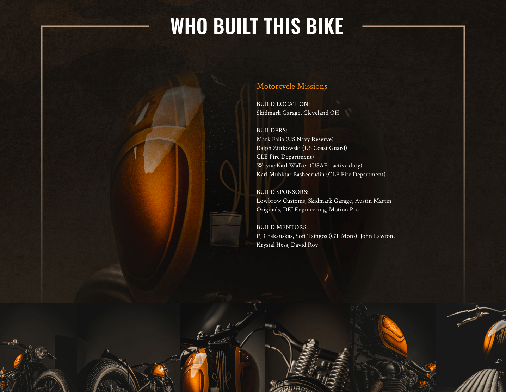

  

    <header class="content-section__header">
      <h3 class="h3">Layout context</h3>
    </header>
    <ul class="bulleted-list">
      <li>Information architecture</li>
      <li>Contents grouping</li>
      <li>Context flow</li>
    </ul>
  

  

    <figure class="project-content__figure project-content__figure--gif pr-8 md:pr-4 lg:pr-8 xl:pr-40 xl:-ml-32">
      
      <figcaption>Fig.1: Wireframe scrolling</figcaption>
    </figure>
  

  

    <figure class="project-content__figure">
      
      <figcaption>Fig.2: Wireframe - header & hero</figcaption>
    </figure>
    <figure class="project-content__figure">
      
      <figcaption>Fig.3: Wireframe - contents 1</figcaption>
    </figure>
    <figure class="project-content__figure">
      
      <figcaption>Fig.4: Wireframe - content 2</figcaption>
    </figure>
    <figure class="project-content__figure">
      
      <figcaption>Fig.5: Wireframe - content 3</figcaption>
    </figure>
  

  

    <header class="content-section__header">
      <h3 class="h3">Visual layout</h3>
    </header>
    <dl class="definition-list">
      <dt>Consistency</dt>
      <dd>Utilize existing visual element e.g., logo, images, color pallet</dd>
      <dt>Concretize</dt>
      <dd>Research similar use-case of the visual concept and build the consensus over the art direction</dd>
    </dl>
  

  

    <figure class="project-content__figure">
      
      <figcaption>Fig.6: Layout - header & hero</figcaption>
    </figure>
    <figure class="project-content__figure">
      
      <figcaption>Fig.7: Layout - content 1</figcaption>
    </figure>
    <figure class="project-content__figure">
      
      <figcaption>Fig.8: Layout - content 2</figcaption>
    </figure>
    <figure class="project-content__figure">
      
      <figcaption>Fig.9: Layout - content 3</figcaption>
    </figure>
    <figure class="project-content__figure">
      
      <figcaption>Fig.10: Layout - content 4</figcaption>
    </figure>
    <figure class="project-content__figure">
      
      <figcaption>Fig.11: Layout - store front</figcaption>
    </figure>
  

  

    <header class="content-section__header">
      <h3 class="h3">Interactive narrative</h3>
    </header>
    <dl class="definition-list">
      <dt>Sequential visual cue</dt>
      <dd>Scroll and reveal i.g., as users scroll page, contents slide-in</dd>
      <dt>Context flow</dt>
      <dd>Whole context flows with interaction to build active communication.</dd>
    </dl>
  

  

    <figure class="project-content__figure project-content__figure--gif pr-8 md:pr-24 lg:pr-16">
      
      <figcaption>Fig.12: Demonstrating interaction</figcaption>
    </figure>
  

  

    <header class="content-section__header">
      <h3 class="h3">Implementation workflow</h3>
    </header>
    <ul class="bulleted-list">
      <li>Try to solve the workflow problem between Shopify server and GitHub version control</li>
      <li>Document details to help team developers to understand workflow obstacles</li>
      <li>Visual presentation of suggested flow</li>
    </ul>
  

  

    <figure class="project-content__figure">
      
      <figcaption>Fig.13: Workflow diagram</figcaption>
    </figure>
    <figure class="project-content__figure">
      
      <figcaption>Fig.14: Workflow document</figcaption>
    </figure>
  

  

    <header class="content-section__header">
      <h3 class="h3">Contribution</h3>
    </header>
    <dl class="project-content__card">
      <dt>Product strategy</dt>
      <dd>
        <ul class="bulleted-list">
          <li>Benchmarking research to see industry opportunity</li>
          <li>Setting product design strategy</li>
          <li>Refine workflow to reconcile Shopify live uploading and GitHub version control</li>
        </ul>
      </dd>
      <dt>UI design</dt>
      <dd>
        <ul class="bulleted-list">
          <li>Creating a high-fidelity UI mock-up</li>
          <li>Creating an interactive prototype using Figma</li>
        </ul>
      </dd>
      <dt>Front-end</dt>
      <dd>
        <ul class="bulleted-list">
          <li>Utilize Theme Kit to build custom Shopify theme</li>
          <li>Liquid, HTML, SCSS to modify new Shopify template</li>
          <li>SCSS, JS to build interactive animation</li>
        </ul>
      </dd>
    </dl>
  

