

  

    <header class="content-section__header">
      <b class="content-section__eyebrow">Product background</b>
      <h3 class="h3">The challenge</h3>
    </header>
    <dl>
      <dt>Product issue</dt>
      <dd>
        As Upward doubles down on marriage-focused dating, it lacked a way to reflect long-term compatibility.
      </dd>
      <dt>User Test Finding</dt>
      <dd>
        <blockquote class="quote">
          "I hate when I'm talking to someone and find out we want something completely different..."
        </blockquote>
      </dd>
      <dt>Product goal</dt>
      <dd>
        Help users express their future vision and discover alignment.
      </dd>
      <dt>Design challenge</dt>
      <dd>
        How might we make it easy to tell and discover a future story without writing an entire article?
      </dd>
    </dl>
  

  

    <figure class="project-content__figure">
      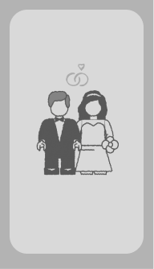
      <figcaption>Who's serious about marriage?</figcaption>
    </figure>
  

  

    <header class="content-section__header">
      <b class="content-section__eyebrow">Key Stage #1</b>
      <h3 class="h3">Exploring: how to make 'abstract' tangible</h3>
    </header>
    <dl>
      <dt>Metaphor-driven</dt>
      <dd>Borrow familiar real-world concepts —for example, building blocks— to help people visualize their future in progress.</dd>
      <dt>Narrative-driven</dt>
      <dd>Convert utilitarian forms into the experience that turned choices about marriage, family, home, and traditions into something people could see taking shape</dd>
    </dl>
  

  

    <figure class="project-content__figure project-content__figure--gif">
      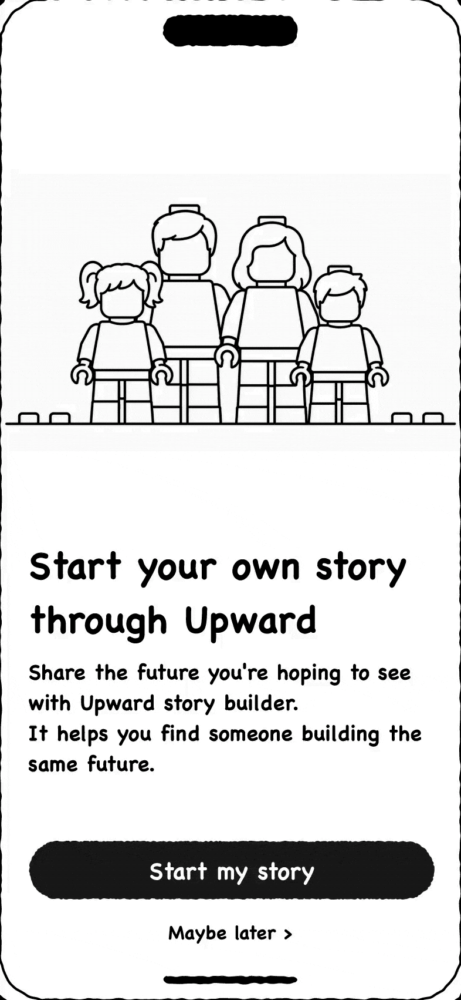
      <figcaption>Fig.1: Visual progress</figcaption>
    </figure>
    <figure class="project-content__figure project-content__figure--gif">
      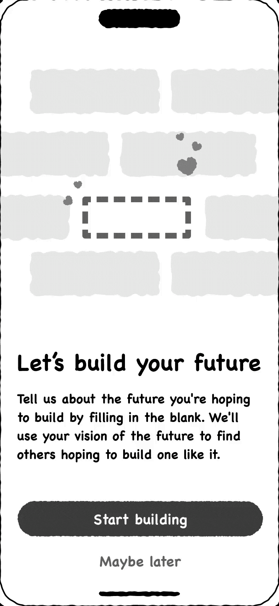
      <figcaption>Fig.2: Story building</figcaption>
    </figure>
  

  

    <header class="content-section__header">
      <b class="content-section__eyebrow">Key Stage #2</b>
      <h3 class="h3">Testing: how would users tell the story</h3>
    </header>
    <dl>
      <dt>Option A — Future Storybook</dt>
      <dd>
        <ul class="bulleted-list">
          <li>A playful, illustrated experience that evolved as users made choices.</li>
          <li>Pros: Emotionally engaging - makes serious topics feel approachable</li>
          <li>Cons: Maybe not the best way to scan information efficiently on other's profile</li>
        </ul>
      </dd>
    </dl>
  

  

    <figure class="project-content__figure">
      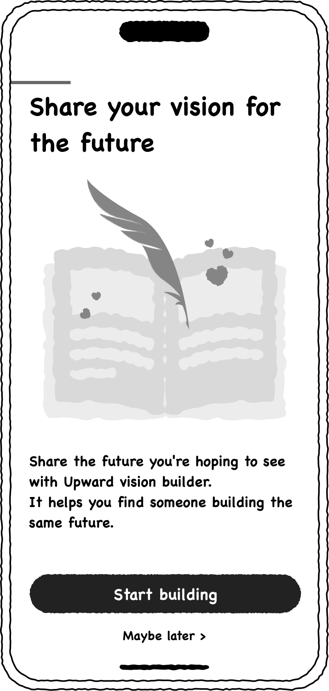
      <figcaption>Fig.3: Option A</figcaption>
    </figure>
    <figure class="project-content__figure">
      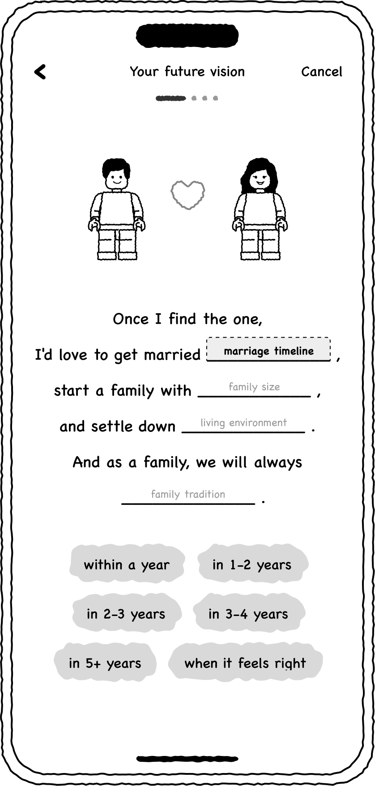
      <figcaption>Fig.4: Option A</figcaption>
    </figure>
    <figure class="project-content__figure">
      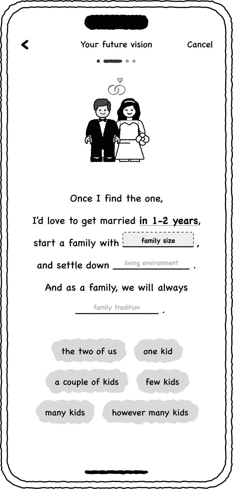
      <figcaption>Fig.5: Option A</figcaption>
    </figure>
    <figure class="project-content__figure">
      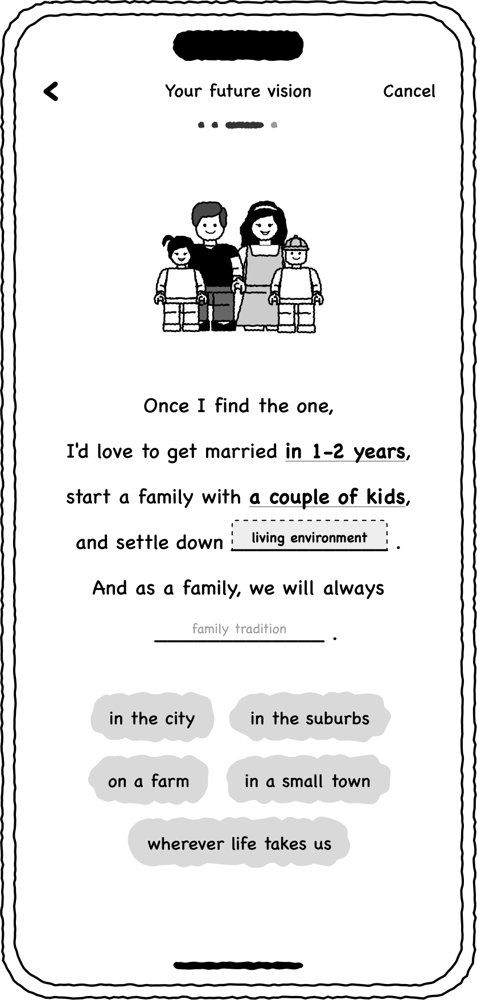
      <figcaption>Fig.6: Option A</figcaption>
    </figure>
    <figure class="project-content__figure">
      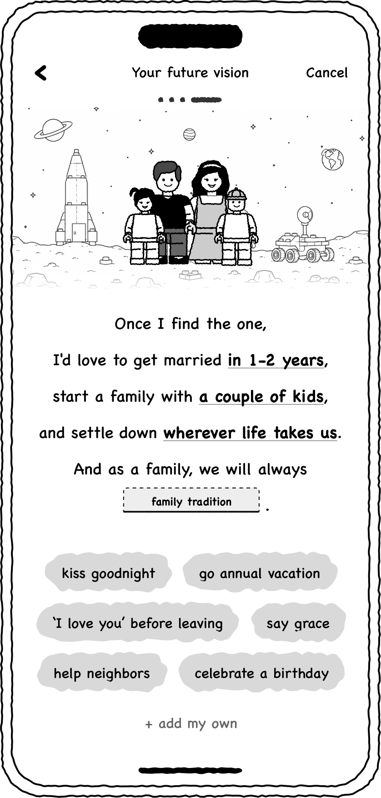
      <figcaption>Fig.7: Option A</figcaption>
    </figure>
  

  

    <dl>
      <dt>Option B — Ideal Future Standard</dt>
      <dd>
        <ul class="bulleted-list">
          <li>A more structured, text-based experience focused on efficiency and clarity.</li>
          <li>Pros: Easier to scan the information from the display POV</li>
          <li>Cons: Feels like "fillinf out a job application"</li>
        </ul>
      </dd>
    </dl>
  

  

    <figure class="project-content__figure">
      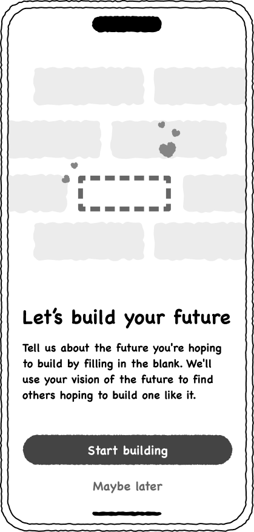
      <figcaption>Fig.8: Option B</figcaption>
    </figure>
    <figure class="project-content__figure">
      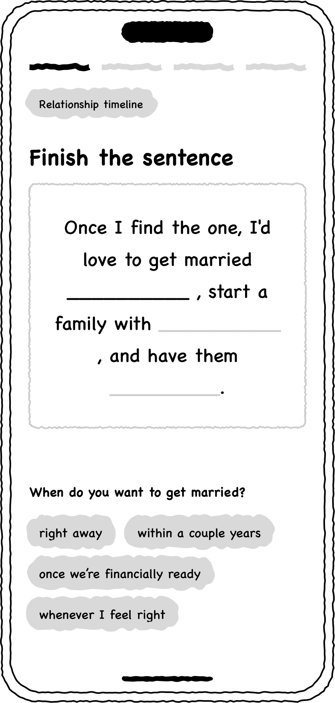
      <figcaption>Fig.9: Option B</figcaption>
    </figure>
    <figure class="project-content__figure">
      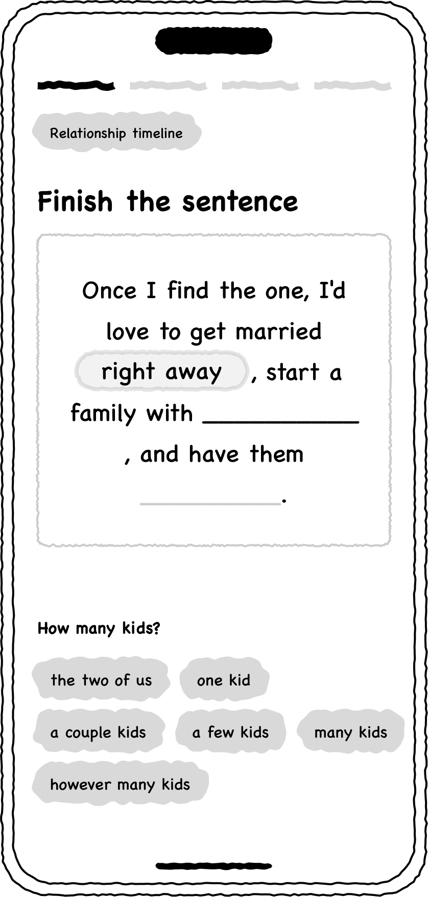
      <figcaption>Fig.10: Option B</figcaption>
    </figure>
    <figure class="project-content__figure">
      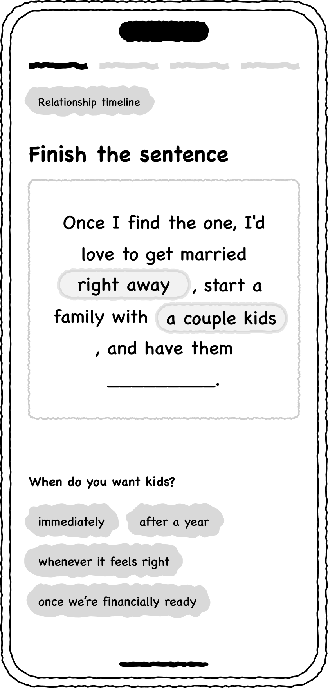
      <figcaption>Fig.11: Option B</figcaption>
    </figure>
    <figure class="project-content__figure">
      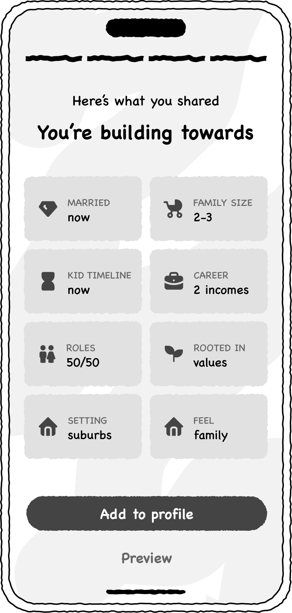
      <figcaption>Fig.12: Option B</figcaption>
    </figure>
  

  

    <header class="content-section__header">
      <b class="content-section__eyebrow">Key Stage #3</b>
      <h3 class="h3">Visualizing: how to show the story</h3>
    </header>
    <dl>
      <dt>3 Visual Concept Options</dt>
      <dd>
        <ul class="bulleted-list">
          <li>"The Toy Story" - idea of 'building blocks' / copyright risk</li>
          <li>"The Retro Illust" - align with new branding / stereotype risk</li>
          <li>"The Boutique Stickers" - align with sticker style / narrower narrative risk</li>
        </ul>
      </dd>
    </dl>
  

  

    <figure class="project-content__figure">
      
      <figcaption>Fig.13: "The Toy Story"</figcaption>
    </figure>
    <figure class="project-content__figure">
      
      <figcaption>Fig.14: "The Retro Illust"</figcaption>
    </figure>
    <figure class="project-content__figure">
      
      <figcaption>Fig.15: "Boutique Stickers"</figcaption>
    </figure>
  

  

    <header class="content-section__header">
      <b class="content-section__eyebrow">Key Stage #4</b>
      <h3 class="h3">Final design: mix & match in retro look</h3>
    </header>
    

      This created a two-part experience: <b>Build your vision → Discover someone else's.</b>
    

    <dl>
      <dt>A's storytelling experience</dt>
      <dd>
        <ul class="bulleted-list">
          <li>to make expressing the future feel approachable and personal</li>
          <li>lands on new onboarding steps</li>
        </ul>
      </dd>
      <dt>B's structured summary view</dt>
      <dd>
        <ul class="bulleted-list">
          <li>to make someone else's future easy to understand at a glance</li>
          <li>lands on new discovery profile section</li>
        </ul>
      </dd>
    </dl>
  

  

    <figure class="project-content__figure project-content__figure--gif">
      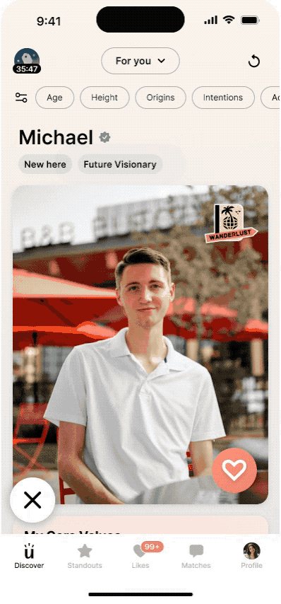
      <figcaption>Fig.16: Discover</figcaption>
    </figure>
    <figure class="project-content__figure project-content__figure--gif">
      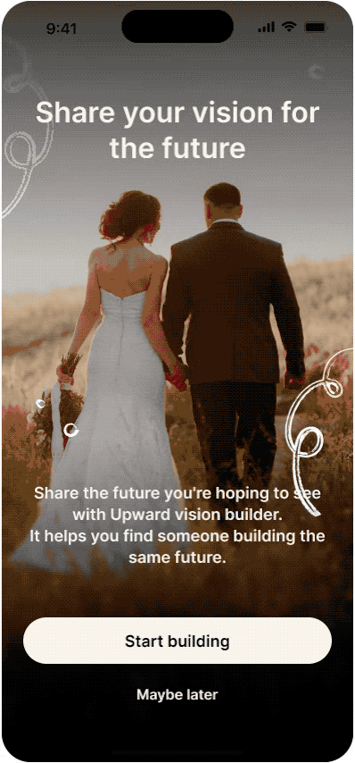
      <figcaption>Fig.17: Onboarding</figcaption>
    </figure>
  

  

    <header class="content-section__header">
      <b class="content-section__eyebrow">Learnings</b>
      <h3 class="h3">"When things feel easy, feel short."</h3>
    </header>
    

      

        The project reinforced that visual storytelling can make an abstract idea easier to understand and talk about—but the interface shouldn't make that story feel like a contract.
      

      

        The best experience gives people enough structure to communicate what matters while leaving room for nuance.
      

    

  

