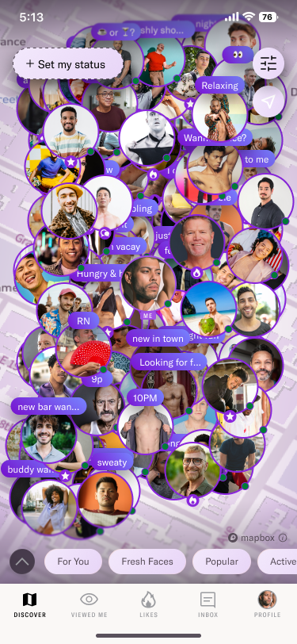
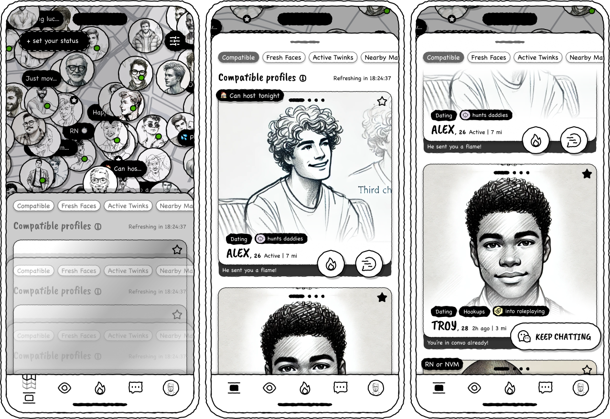
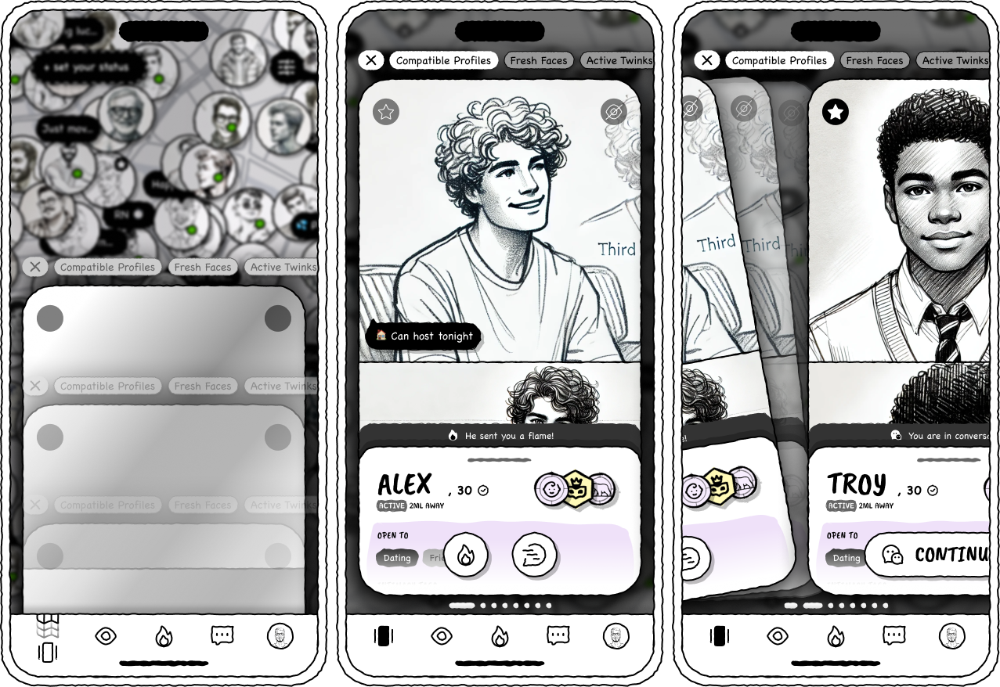
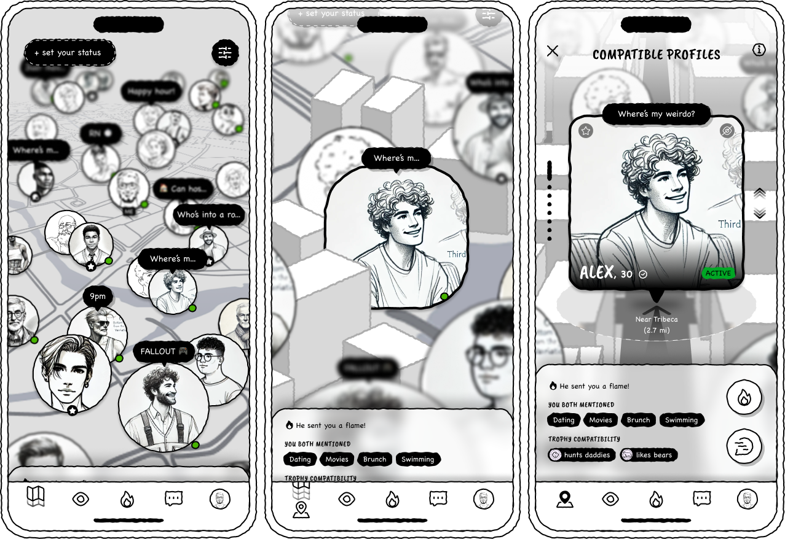
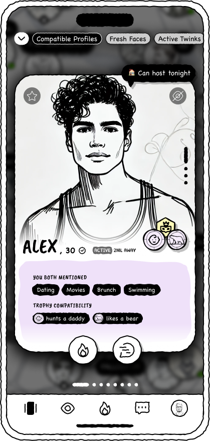
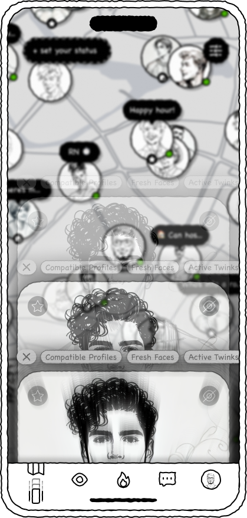
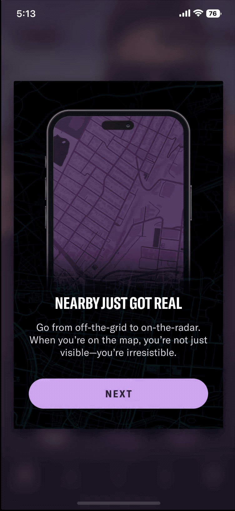
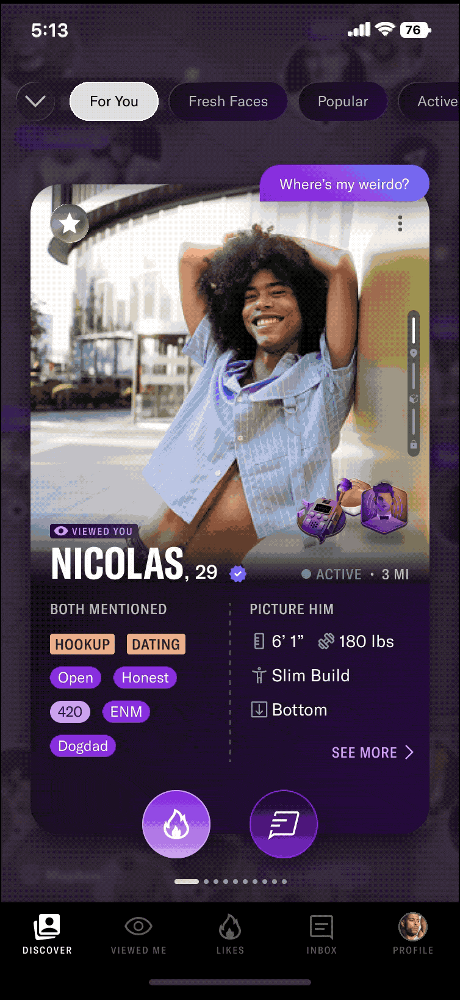

  

    <header class="content-section__header">
      <b class="content-section__eyebrow">Project background</b>
      <h3 class="h3">The challenge</h3>
    </header>
    <dl>
      <dt>Product issue</dt>
      <dd>
        Map discovery gave users freedom but lacked a clear starting point, leading to low engagement.
      </dd>
      <dt>Product goal</dt>
      <dd>
        Increase profile views and engagement by helping users discover relevant people more easily.
      </dd>
      <dt>Design challenge</dt>
      <dd>
        How might we guide users toward meaningful connections without taking away their freedom to explore?
      </dd>
    </dl>
  

  

    <figure class="project-content__figure">
      
      <figcaption>Fig.1: More isn't always better</figcaption>
    </figure>
  

  

    <header class="content-section__header">
      <b class="content-section__eyebrow">Key Stage #1</b>
      <h3 class="h3">Exploring: Finding direction in an open map</h3>
    </header>
    

      Explore why an open map can feel aimless, and how clearer starting points and contextual cues could help.
    

    <ul class="bulleted-list">
      <li>Too many or too few people nearby.</li>
      <li>Little context beyond a single photo.</li>
      <li>Often the same people users saw yesterday.</li>
    </ul>
  

  

    

      <dl class="mb-4">
        <dt>Option 1. Browsing feed</dt>
        <dd>
          <ul class="bulleted-list">
            <li>Curated profiles ordered by proximity.</li>
            <li>Key profile information and actionable buttons at a glance.</li>
          </ul>
        </dd>
      </dl>
      <figure class="project-content__figure">
        
        <figcaption>Fig.2: Browsing feed</figcaption>
      </figure>
    

    

      <dl class="mb-4">
        <dt>Option 2. Focused browsable carousel</dt>
        <dd>
          <ul class="bulleted-list">
            <li>Curated profiles ordered by proximity.</li>
            <li>Profile highlight with full-profile access</li>
          </ul>
        </dd>
      </dl>
      <figure class="project-content__figure">
        
        <figcaption>Fig.3: Browsable carousel</figcaption>
      </figure>
    

    

      <dl class="mb-4">
        <dt>Option 3. Zoomed-In 3D Navigation</dt>
        <dd>
          <ul class="bulleted-list">
            <li>Zoom in on one profile at a time.</li>
            <li>Explore a heads-up display (HUD) for profile highlights.</li>
          </ul>
        </dd>
      </dl>
      <figure class="project-content__figure">
        
        <figcaption>Fig.4: Zoomed-in 3D navigation</figcaption>
      </figure>
    

  

  

    <header class="content-section__header">
      <b class="content-section__eyebrow">Key Stage #2</b>
      <h3 class="h3">Re-routing: Measuring focus and freedom</h4>
    </header>
    

      Reduce distractions without sacrificing the freedom to explore.
      <b class="block">↳ Introduce a hybrid map discovery model with Focus Mode.</b>
    

    <dl>
      <dt>Focuse mode</dt>
      <dd>
        <b>One proflie at a time:</b> A focused discovery flow with actionable profile previews.
      </dd>
      <dt>Exit anytime</dt>
      <dd>
        <b>Stay in control:</b> Users can leave the focused flow and continue exploring map freely.
      </dd>
    </dl>
  

  

    <figure class="project-content__figure">
      
      <figcaption>Fig.3: Focus mode</figcaption>
    </figure>
    <figure class="project-content__figure">
      
      <figcaption>Fig.4: Exiting to map</figcaption>
    </figure>
  

  

    <header class="content-section__header">
      <b class="content-section__eyebrow">Key Stage #3</b>
      <h3 class="h3">Re-targeting: Tuning the goal-oriented UX</h3>
    </header>
    

      Go deep to connect, or go wide to explore <b>- one at a time.</b>
    

    <dl>
      <dt>Focus mode layout option</dt>
      <dd>
        <ul class="bulleted-list">
          <li>Option A — Photo-First: Prioritize profile photos and compatibility signals.</li>
          <li>Option B — Editorial: Prioritize profile content through an editorial layout.</li>
        </ul>
      </dd>
    </dl>
  

  

    <figure class="project-content__figure project-content__figure--gif">
      
      <figcaption>Fig.5: Option A</figcaption>
    </figure>
    <figure class="project-content__figure project-content__figure--gif">
      
      <figcaption>Fig.6: Option B</figcaption>
    </figure>
  

  

    <header class="content-section__header">
      <b class="content-section__eyebrow">Key Stage #4</b>
      <h3 class="h3">Final design: Focus Mode with the freedom to exit</h3>
    </header>
  

  

    <figure class="project-content__figure project-content__figure--gif">
      
      <figcaption>Fig.7: Feature adoption</figcaption>
    </figure>
    <figure class="project-content__figure project-content__figure--gif">
      
      <figcaption>Fig.6: Introducing Focus Mode</figcaption>
    </figure>
    <figure class="project-content__figure project-content__figure--gif">
      
      <figcaption>Fig.6: Exploring profiles in Focus Mode</figcaption>
    </figure>
  

  

    <header class="content-section__header">
      <b class="content-section__eyebrow">Learnings</b>
      <h3 class="h3">"Have options, not distractions"</h3>
    </header>
    

      

        More options without mindful guadience, are distraction. The key is to give users enough direction to take the next step, while keeping them in control of where they go.
      

      

        Good discovery isn't about showing users everything. It's about helping them find what matters to them.
      

    

  

